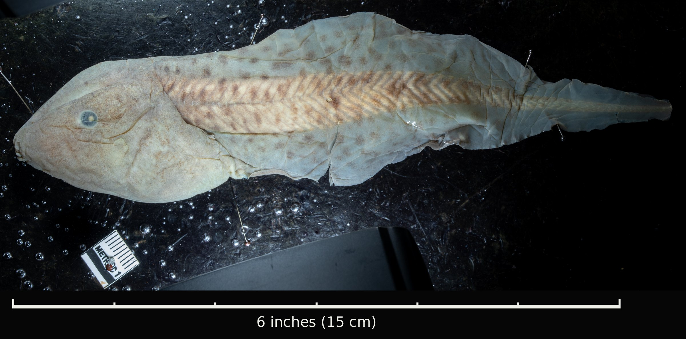
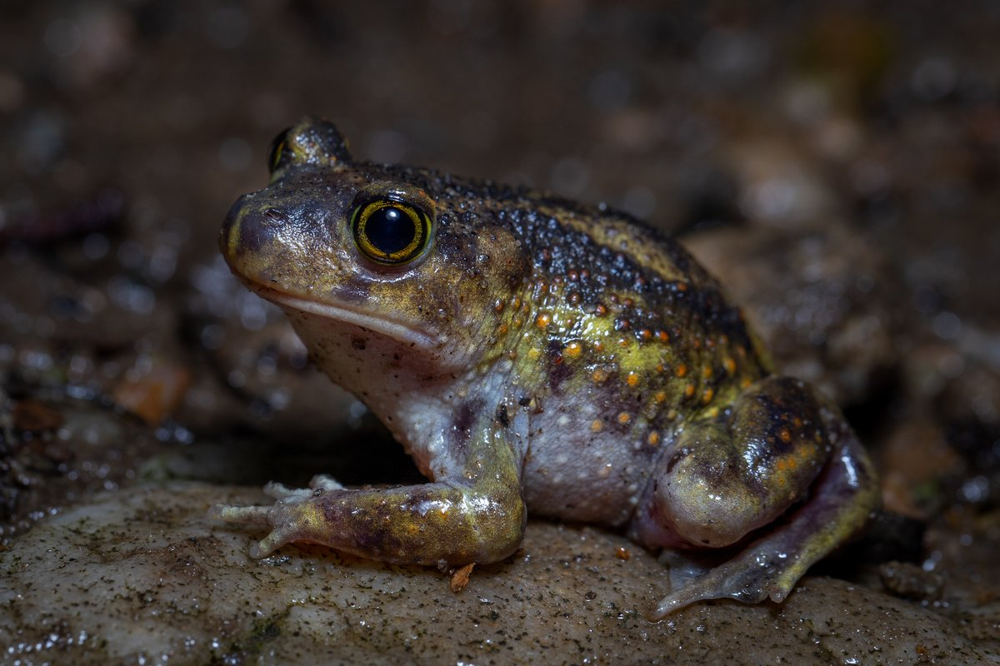
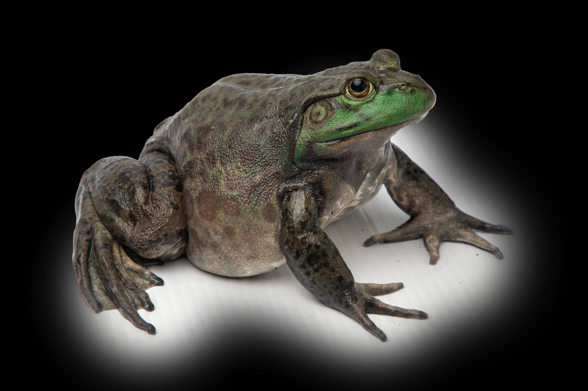

There are a couple of fun answers to this question!

## 1. The biggest naturally occurring tadpoles

The paradoxical frog, *Pseudis paradoxa*, is a really cool animal. This species has relatively small frogs, just about three inches at maximum size. Their tadpoles, however, are gigantic! They can grow up to about 9 inches long, so when you include their tails, the tadpoles are three or four times longer than the frogs they turn into. That apparent paradox, a frog that seems to shrink as it grows up, is where the species gets its name, and it even holds a [Guinness World Record](https://www.guinnessworldrecords.com/world-records/381875-greatest-size-difference-between-tadpole-and-adult-frog-of-same-species) for the biggest size difference between a tadpole and an adult frog.

{fig-alt="A huge, pale, spotted tadpole specimen with a broad head and long tail, pinned on a dark background above a six-inch scale bar that it is longer than"}

This species demonstrates a really cool part of frog evolution. There is a fundamental trade-off between growing as big as you can while you're a tadpole vs. getting out of the water as soon as possible. Frogs that breed in temporary puddles that dry up after a few weeks often don't grow very much, metamorphosing at small sizes. These species grow a lot as a frog, having to spend a year or two eating and growing before they are big enough to breed. Other frogs live in permanent ponds, swamps and lakes, where there's no rush to leave, and they can grow a lot as tadpoles.

:::: {.diorama .pairs .long}
{fig-alt="A plump brown spadefoot with large golden eyes, sitting on wet ground"}

{fig-alt="A large olive-brown bullfrog with a bright green face, sitting on a pale surface"}
::::

*Pseudis*, which often lives in permanent swamps, takes this to the extreme. Its tadpoles don't actually grow any faster than other tadpoles. Instead of moving on to metamorphosis, they [just keep growing](https://www.thebhs.org/publications/the-herpetological-journal/volume-19-number-1-january-2009/537-02-the-paradoxical-frog-i-pseudis-paradoxa-i-larval-habitat-growth-and-metamorphosis/file), and they come out the other side at nearly full adult size, already close to being ready to breed. Once they're frogs, they barely grow at all.

## 2. The biggest tadpole ever recorded

The largest tadpole ever recorded is actually an American bullfrog tadpole from southeastern Arizona, at just over 10 inches long (257 mm), beating even the biggest paradoxical frog tadpoles. American bullfrogs are not native to this region, but were brought to the Southwest in the 1900s, back when frog legs were a popular food, and they've since become a serious invasive pest there, eating and outcompeting native frogs.

In 2018, while volunteers were clearing invasive bullfrogs out of a pond at the Southwestern Research Station in the Chiricahua Mountains, they found an extremely large individual tadpole, nicknamed "Goliath", apparently growing nonstop and never approaching metamorphosis. Even at that size, it still had the body of a very young tadpole, without even the start of a pair of back legs. Goliath died in 2019 and was preserved for study. There's an interesting question here about why it never turned into a frog. Was there something in the water, like a chemical, that prevented it? Was it something to do with the extreme heat? Or was it just a genetic anomaly? Whatever the cause, the best guess is that the hormones that normally trigger metamorphosis, like thyroid hormone, were [switched off](https://www.americanscientist.org/blog/from-the-staff/the-giant-tadpole-that-never-got-its-legs), while the ones that drive growth kept going. [Either way, this tadpole is something to behold.](https://www.livescience.com/63238-goliath-giant-tadpole.html)
