No, not all frogs have tadpoles. Some frogs develop directly from eggs, hatching out as tiny froglets. Others are "born" as little froglets. And even among the frogs that do have tadpoles, plenty of them raise those tadpoles in some pretty unexpected places.

Frogs have a wide variety of what are called "reproductive modes". Some involve a tadpole (larval stage) of some kind, while others skip the larval stage entirely. In fact, the life cycle most of us learned in school, where eggs are laid in a pond and hatch into tadpoles that swim around until they turn into frogs, is actually in the minority. When a team of biologists sorted out the life cycles of more than 7,000 species of frogs, they found that [fewer than half of them](https://www.nature.com/articles/s41467-022-34474-4) do it that way.

## Tadpoles in strange places

::::: {.photo-aside}
:::: {.aside-text}
Let's start with the frogs that do have tadpoles, just not where you'd expect to find them. More than half of all frog species lay their eggs out of the water, on leaves, in burrows or in the leaf litter. Many of those still have regular swimming tadpoles, which just have to find their way to the water once they hatch, and they often get some help from their parents.

Glass frogs, for example, lay their eggs on leaves hanging over streams. In many species, the father stands guard over the eggs, keeping them moist and protecting them from predators, until the tadpoles hatch and drop into the water below.
::::

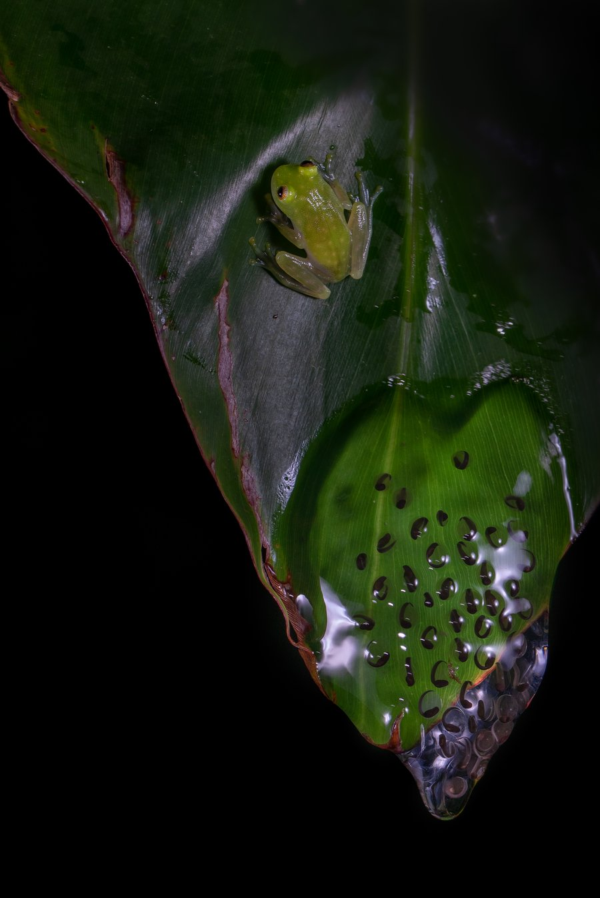{fig-alt="A small lime-green glass frog sitting on a dark leaf, above a clutch of clear eggs with dark, curled embryos at the leaf's tip"}
:::::

:::: {.diorama .long}
::: {.diorama-label}
Eggs out of the water
:::

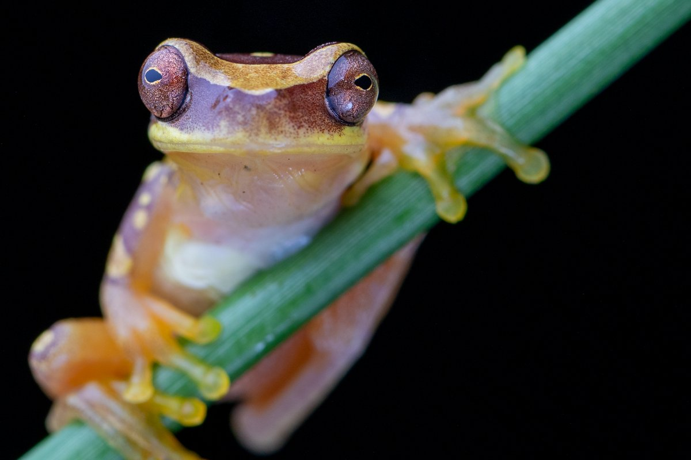{fig-alt="A small tan-and-orange treefrog with big reddish eyes, clinging to a green stem"}

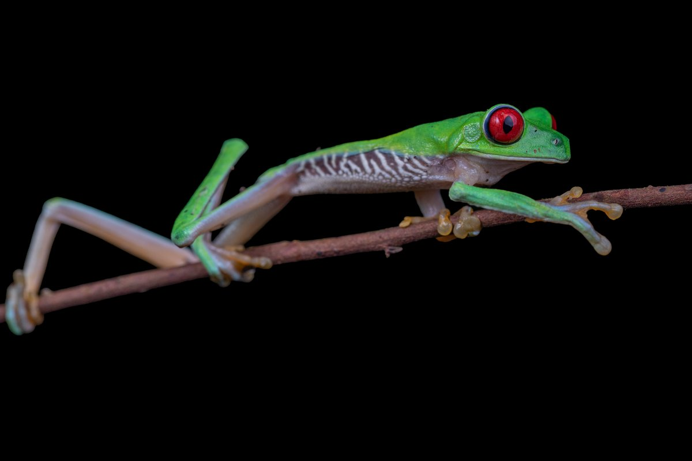{fig-alt="A bright green tree frog with red eyes and long orange-toed legs, stretched along a twig"}

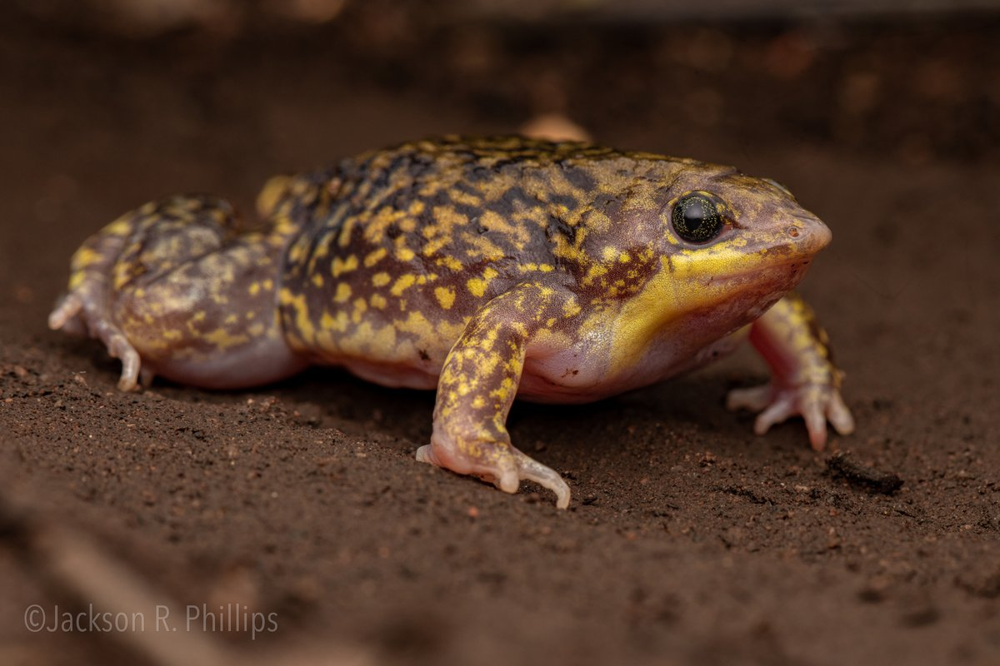{fig-alt="A plump, yellow-and-brown speckled frog with a small pointed head, walking on bare soil"}

::: {.diorama-label}
Tadpoles that hitch a ride
:::

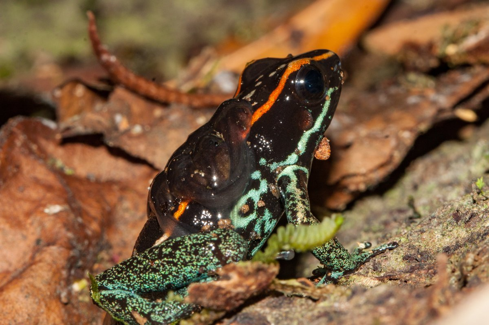{fig-alt="A black poison frog with an orange stripe and green speckled legs, with two dark tadpoles stuck to its back"}

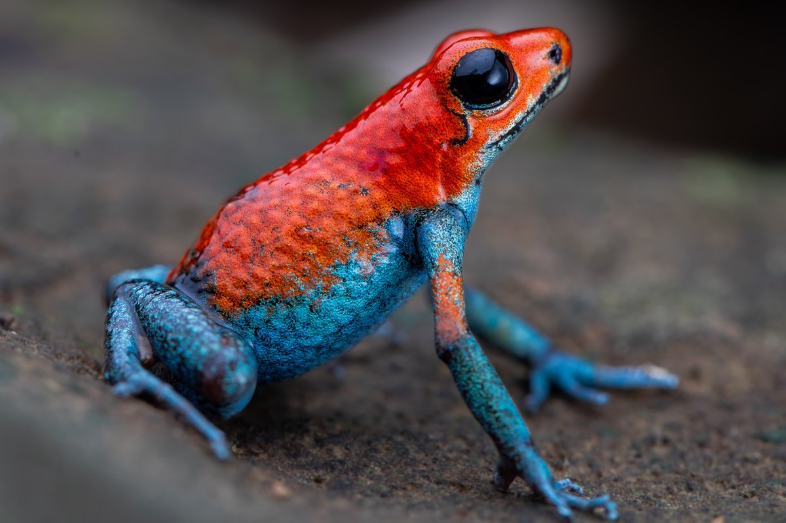{fig-alt="A tiny poison frog with a bright red back and blue legs, standing on a rock"}

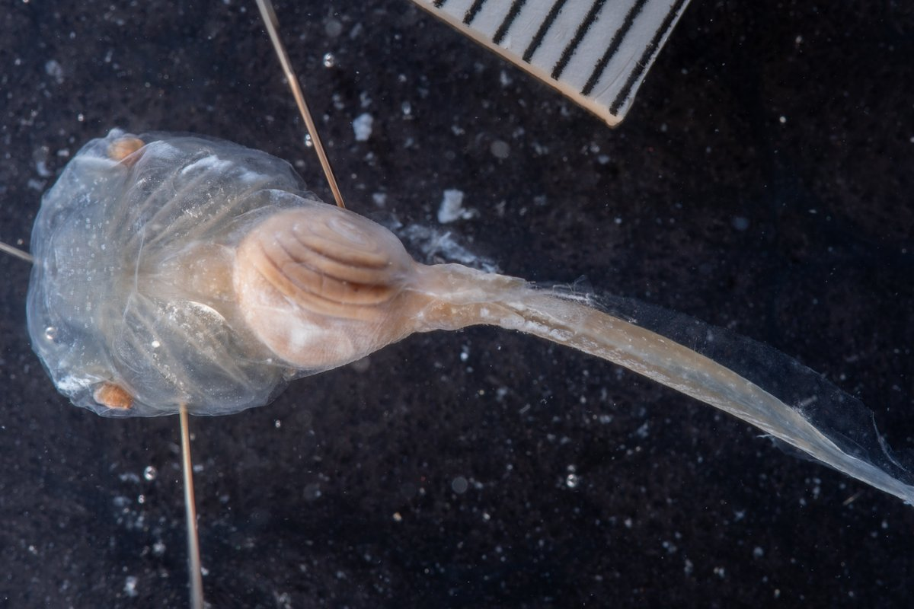{fig-alt="A preserved, see-through tadpole with a broad head, a coiled gut and a long thin tail, pinned next to a scale bar"}
::::

Some tadpoles never touch the water at all. The tadpoles of the Seychelles frog hatch on land, climb onto their father's back, and ride there until they turn into frogs.

:::: {.diorama .pairs .wide .long}
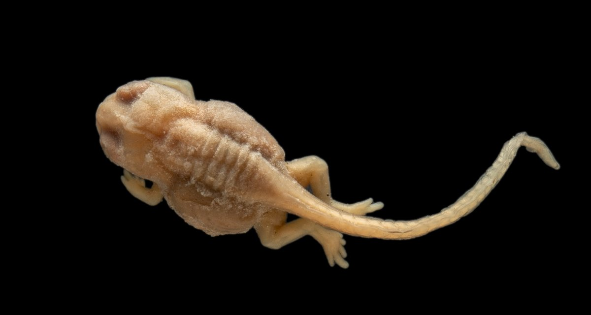{fig-alt="A preserved tadpole with four legs and a long, curled tail, on a black background"}

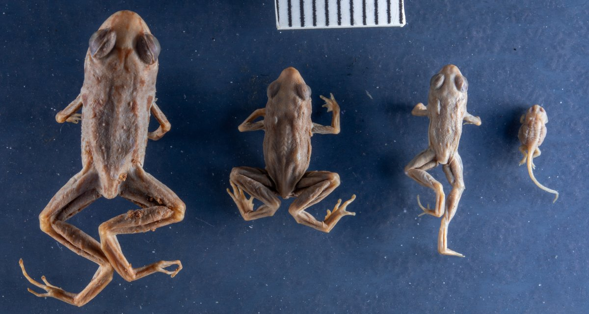{fig-alt="Four preserved frogs in a row from largest to smallest on a blue background, the smallest still with a tail, next to a scale bar"}
::::

And then there are the truly bizarre ones.

Darwin's frogs in the genus *Rhinoderma* do something really strange. The female lays her eggs on land, in the leaf litter of the forests of southern Chile and Argentina, and the male stays nearby to guard them. After about three weeks, when the tadpoles are starting to wriggle inside their eggs, he appears to gobble them up. But instead of swallowing them, he keeps them in his vocal sac, the stretchy pouch of skin he uses to call. The tadpoles hatch in there and live in the sac for another two months or so, surviving off their yolk and a nutritious goo that their father produces, until they transform into little froglets and climb out of his mouth.

There used to be two species of Darwin's frogs. The other one, the Chile Darwin's frog, only kept its tadpoles in the vocal sac for a short time before spitting them out into the water to finish growing up. Sadly, it hasn't been seen since 1981, and the remaining Darwin's frog is endangered, with the chytrid fungus thought to be a big part of why.
<!-- TODO: link "chytrid fungus" to the chytrid FAQ once that page is published -->

In Australia, there were once two species of frogs that did something even stranger. The gastric-brooding frogs (*Rheobatrachus*) also gobbled up their young, but in their case, it was the mother, and the young went into her actual stomach. Nobody ever got to see whether she swallowed eggs or freshly hatched tadpoles, but either way, the tadpoles lived in her stomach for six weeks or more. The whole time, she stopped eating and her stomach stopped making acid, until the babies emerged from her mouth as fully formed little froglets. Sadly, neither species has been seen in about forty years, and both are now considered extinct.

## No tadpole at all: direct development

Many frogs skip the tadpole stage entirely. In these "direct developers", the eggs are often laid on land, and instead of building a tadpole, the embryo grows straight into a little frog right there inside the egg, living off its yolk until it hatches out as a tiny frog. Most of what makes a tadpole a tadpole, like the little beak and rows of tiny teeth that tadpoles use to scrape up their food, never develops at all.

This strategy is actually really common in frogs. About a quarter of all frog species are direct developers, and some entire frog families are direct developers, including famous animals like the coquí of Puerto Rico. In fact, the robber frogs of the genus *Pristimantis*, with more than 500 species, are the biggest genus of vertebrates on the planet, and as far as anyone knows, every single one of them skips the tadpole.

:::: {.diorama .long}
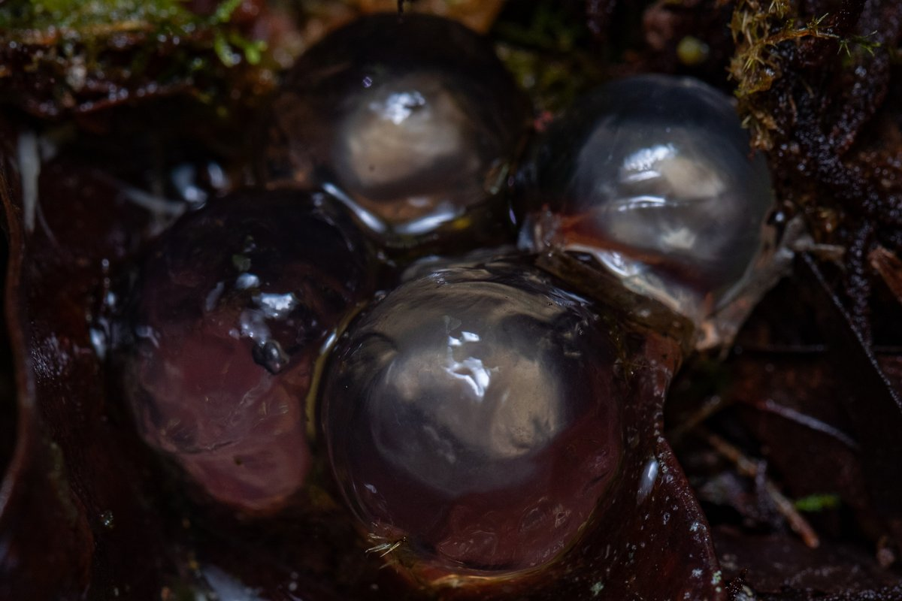{fig-alt="Four large, clear, round frog eggs nestled in wet moss and leaf litter"}

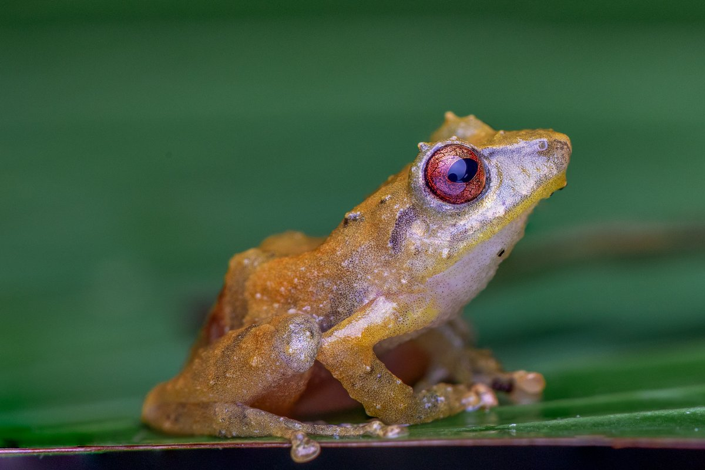{fig-alt="A small orange-tan frog with a red eye, sitting on a green leaf"}

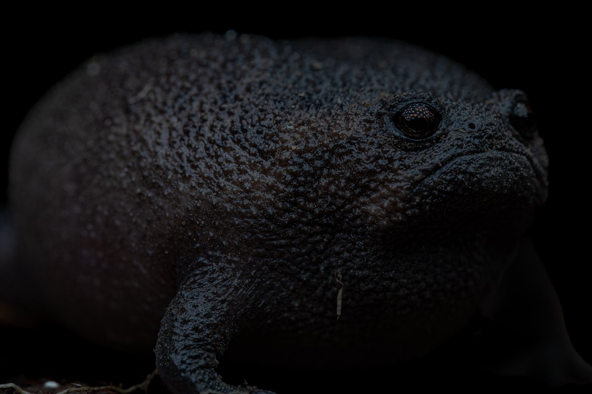{fig-alt="A round, black, rough-skinned frog against a dark background"}
::::

## Live birth

A very small number of frogs give live birth. In those cases, female frogs take in sperm, fertilizing the eggs inside the body, where the "tadpoles" develop and transform before being "born" as little froglets. This strategy is extremely rare, with only about a dozen known species that do it, most of them small toads from the mountains of Africa. One of them, the Nimba toad of West Africa, even feeds its developing babies a kind of "milk" made inside the mother's body. Another was a cousin of the coquí, the golden coquí of Puerto Rico, which sadly hasn't been seen in decades.

But even live birth doesn't always mean skipping the tadpole. In 2014, biologists described a new species of fanged frog from the Indonesian island of Sulawesi, *Limnonectes larvaepartus*, whose name means "larva birth". Like the frogs above, the females carry fertilized eggs inside their bodies, but instead of froglets, they [give birth to tadpoles](https://journals.plos.org/plosone/article?id=10.1371/journal.pone.0115884), which then finish growing up in the water like any other tadpole.

## So, do all frogs have tadpoles?

No. But most frogs, nearly three out of every four species, still have a tadpole of some kind, even if it never sees a pond.

There's one more twist to the story. You might expect that once a group of frogs loses its tadpole, that's the end of it. But there's evidence that the marsupial frogs (*Gastrotheca*), whose mothers carry their eggs in a pouch on their backs, may have lost the tadpole stage and then [evolved it all over again](https://doi.org/10.1111/j.1558-5646.2007.00159.x). Today, some species release tadpoles from the pouch, while others raise froglets in it. How, and whether, a lost trait can come back like that is one of the big questions my own research tries to answer.
