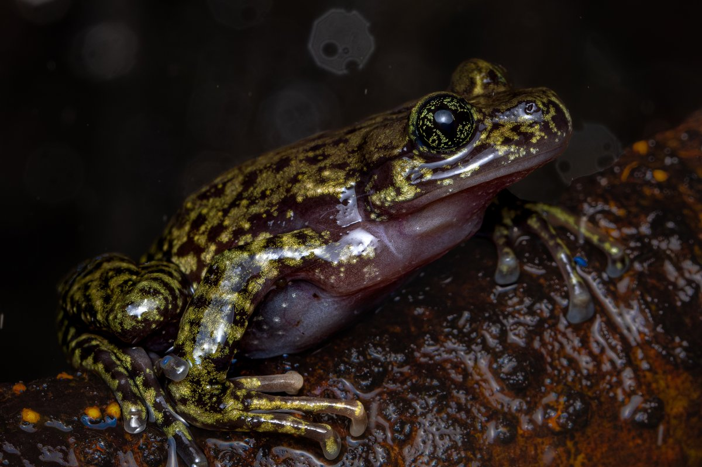
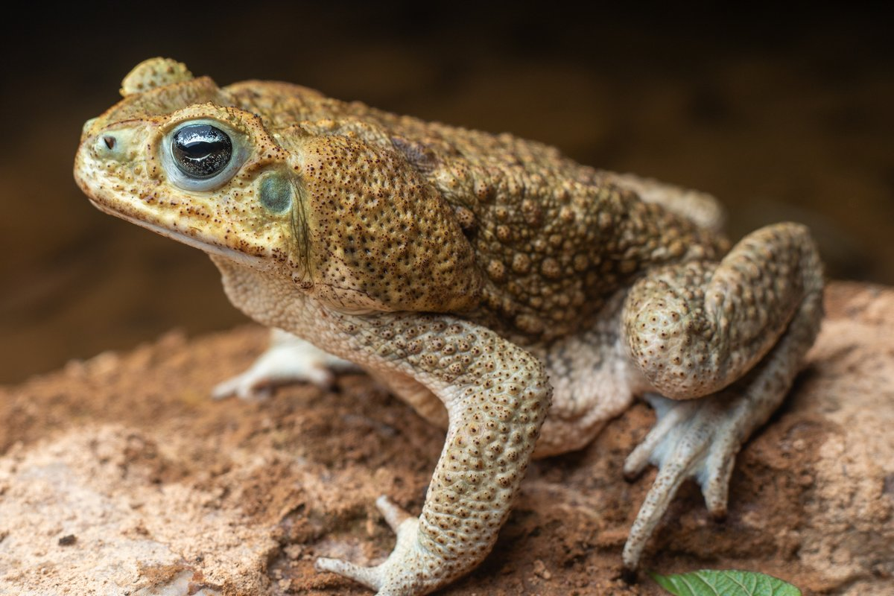
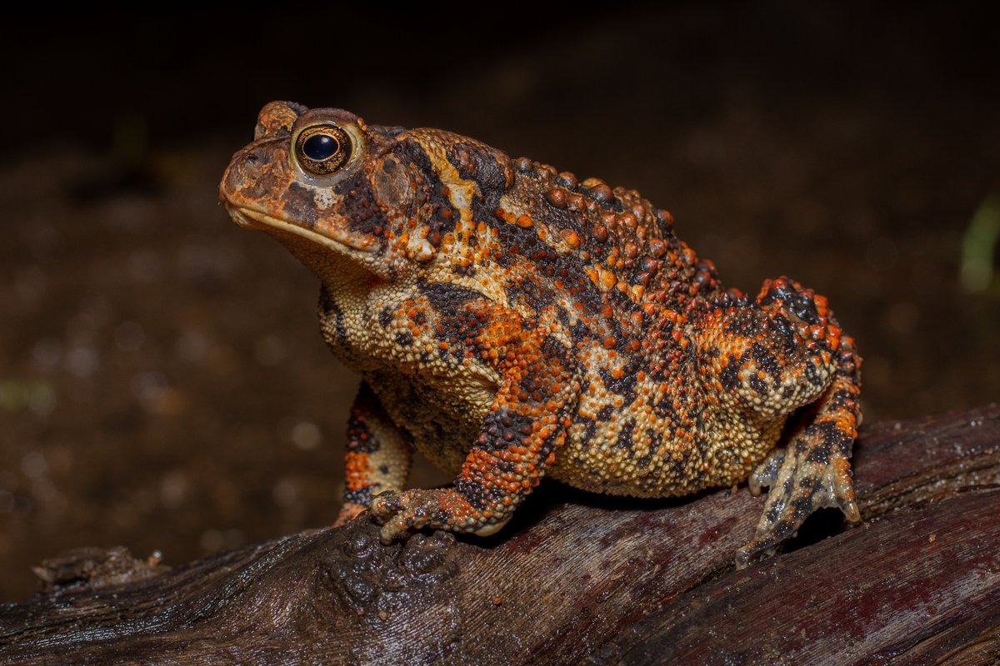
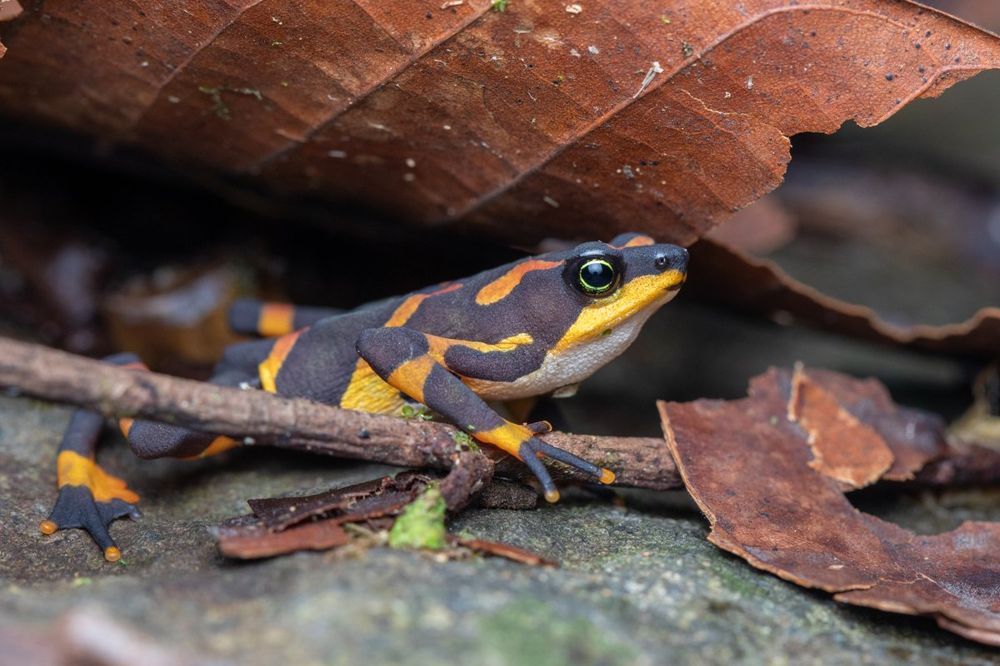
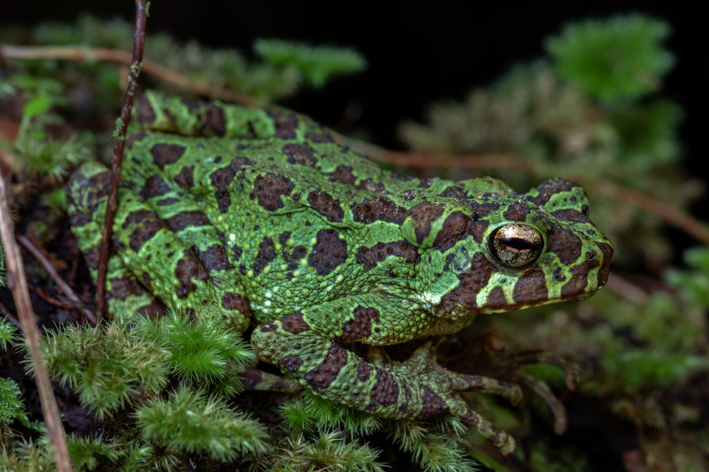
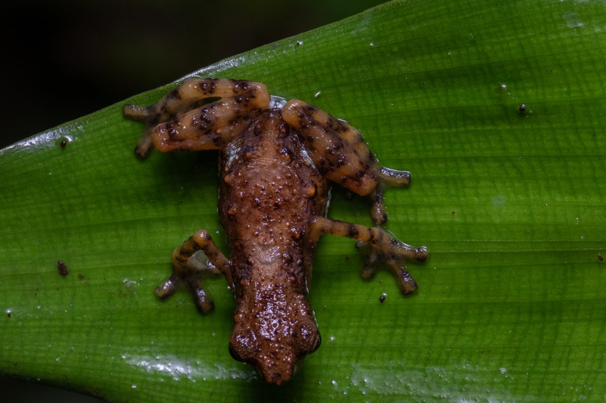
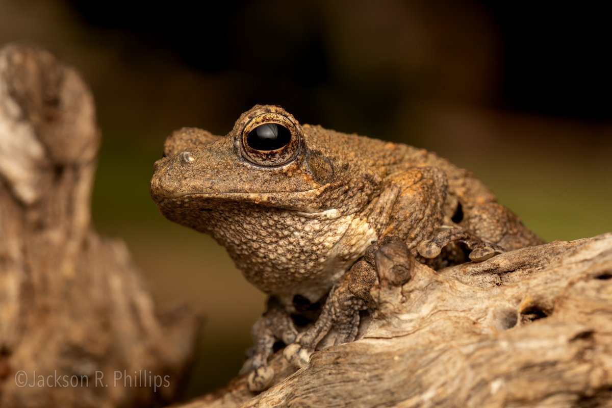

This is maybe the most commonly asked question that I get from people when they find out what I do. Unfortunately, the answer somewhat depends on who you ask.

But I encourage you to read on, because the answer actually reveals a lot about how we think about language and nature. English is not the only language that separates frogs and toads. Instead, many languages across different regions make the same distinction, from Spanish (*rana*/*sapo*) to Japanese (カエル/ガマ) to Quechua (*k'ayra*/*hamp'atu*).

There are two ways of thinking about the differences between frogs and toads.

## 1. By the skin

Here, frogs and toads are different animals. Both have roughly the same shape, of course, but their skin is quite different. Toads are dry and bumpy, while frogs are smooth and moist. "Toads" also tend to be more terrestrial, while frogs are more aquatic.

:::: {.diorama}
::: {.diorama-label}
Frogs: smooth, moist skin
:::

{fig-alt="A large olive-brown bullfrog with a bright green face, sitting on a pale surface"}

{fig-alt="A bright green tree frog with red eyes and long orange-toed legs, stretched along a twig"}

{fig-alt="A smooth, wet, olive-and-black mottled frog sitting on a wet rock"}

::: {.diorama-label}
"Toads": dry, bumpy skin
:::

{fig-alt="A large, warty, tan toad with big glands behind its eyes, sitting on a rock"}

{fig-alt="A warty orange-and-brown toad sitting on a log"}

{fig-alt="A plump brown spadefoot with large golden eyes, sitting on wet ground"}
::::

This is what most people mean, across different languages and dialects, when they say "toad". There are exceptions to this, of course. For example, the Suriname "toad", as it is commonly called, is a very bizarre animal. It has somewhat rough skin (and a crazy style of giving birth, with the babies popping [out of the mother's back](https://www.youtube.com/watch?v=SgROaJY6Xnk)), but it is totally aquatic. I'd never think to call this animal a toad, but many people do.

And that leads us to a bigger question: what actually makes a good definition?

## Two ways to define a group of animals

There are two ways of defining groups of animals. The first is called a ***diagnostic definition***: a practical definition built to make it easy to apply to unknown things. The skin-based definition above is a diagnostic one. For a toad, you might say that a toad is a four-legged animal without a tail and with dry, bumpy skin. That works pretty well in the vast majority of cases.

Diagnostic definitions have a famous weak spot, though. [Plato](https://en.wikipedia.org/wiki/Plato) once defined a person as a "featherless biped", which also works pretty well in the vast majority of cases. Then [Diogenes](https://en.wikipedia.org/wiki/Diogenes), a rival philosopher who loved to needle Plato, plucked a chicken, brought it into Plato's school and declared, "Here is Plato's man!" Plato's fix was to add "with broad, flat nails" to his definition. Indeed, Diogenes' chicken was a challenge to diagnostic definitions in general, and the same challenge applies to our dry toad. Can you make a frog dry enough to be a toad?

The alternative approach to defining animal groups was made possible by Darwin: evolutionary groups. Once we understand that all living things are related, we can split up that family tree into what are called ***natural groups***, defined by who is related to whom rather than by what they look like.

## 2. By the family tree

It turns out that there is one group of frogs we call the Bufonidae (*bufo* means toad in Latin) that mostly have dry skin and warty bumps. We call this group the "true toads", and they include many of the most common "toads" around the world.

Bufonids are extremely common and well-represented on every continent except Australia and Antarctica. Even in Australia, cane toads brought in to control beetles in the sugarcane fields are now a common pest across much of the northern region.

For most frog experts, when we say "toad", we mean a member of the bufonid family. That means that toads are just a kind of frog. Think rectangles and squares: all squares are rectangles, but not all rectangles are squares. All toads are frogs, but not all frogs are toads.

Something interesting about this definition is that it excludes many dry-skinned frogs that independently evolved the same skin and habitats as true toads. Spadefoot toads, midwife toads, fire-bellied toads and our friend the Suriname toad all have "toad" in their names, but none of them are bufonids. Even within a single family, the names can't always agree: in the Asian family Megophryidae, some species are called horned frogs and others are called lazy toads.

On the same note, some bufonids (true toads) have evolved to be more aquatic, with wet or smooth skin. An evolutionary definition counts these as toads regardless of their skin. Instead, we know they are toads because their DNA is most similar to other true toads. We define them by their place in the tree of life, not the bumpiness of their skin.

:::: {.diorama}
::: {.diorama-label}
True toads (Bufonidae) that don't look the part
:::

{fig-alt="A smooth black toad with bright yellow-orange markings walking over leaf litter"}

{fig-alt="A green toad with dark blotches sitting in moss"}

{fig-alt="A small brown toad with banded legs, seen from above on a green leaf"}

::: {.diorama-label}
Toad-like, but not true toads
:::

{fig-alt="A plump brown spadefoot with large golden eyes, sitting on wet ground"}

{fig-alt="A round, black, rough-skinned frog against a dark background"}

{fig-alt="A rough-skinned brown tree frog with a large dark eye, perched on weathered wood"}
::::

If this sounds familiar, it's the same reason you might hear that birds are dinosaurs. A robin doesn't look much like a *T. rex*, but birds sit squarely inside the dinosaur family tree, so evolutionarily, they are dinosaurs. Toads are frogs for exactly the same reason.

## So, what's the right answer?

In everyday language, a toad is a frog with dry, bumpy skin that spends a lot of its time on land. To a herpetologist, a toad is a member of one particular family of frogs, the Bufonidae. Either way, every toad is a frog.

