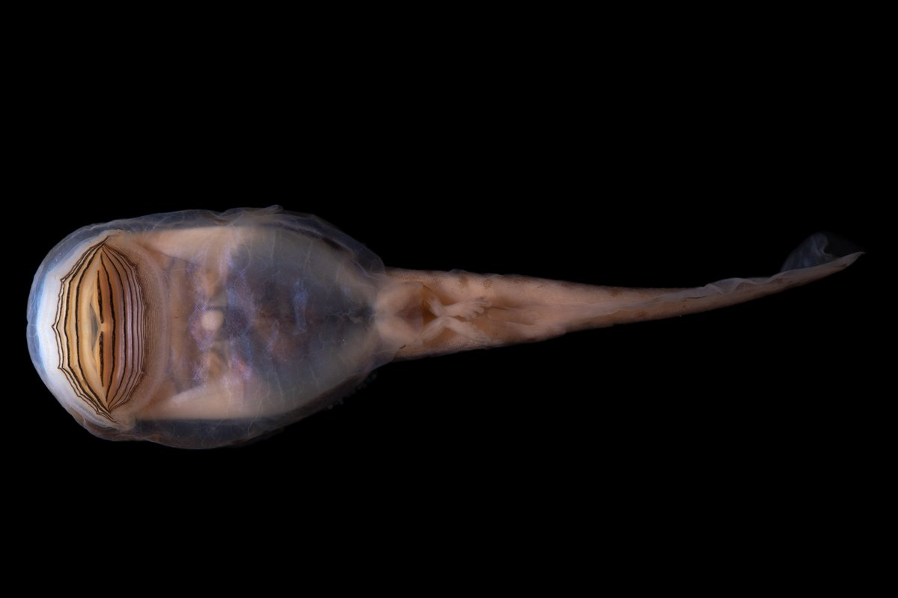
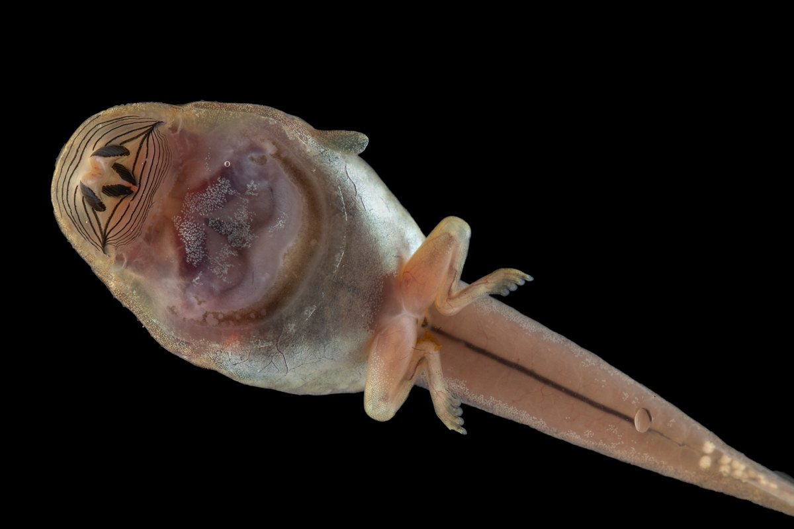
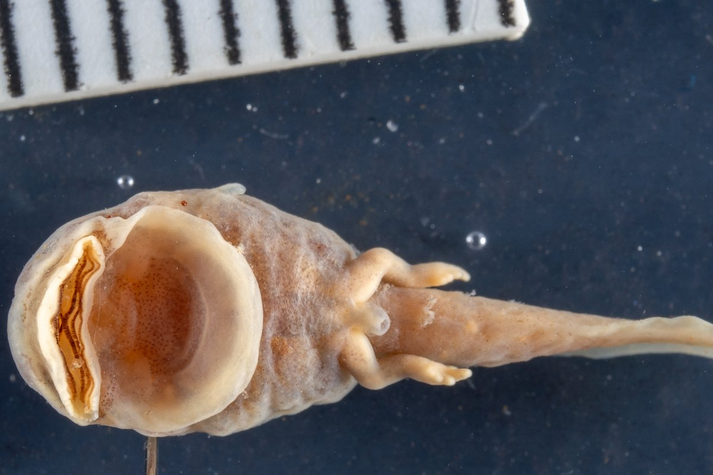
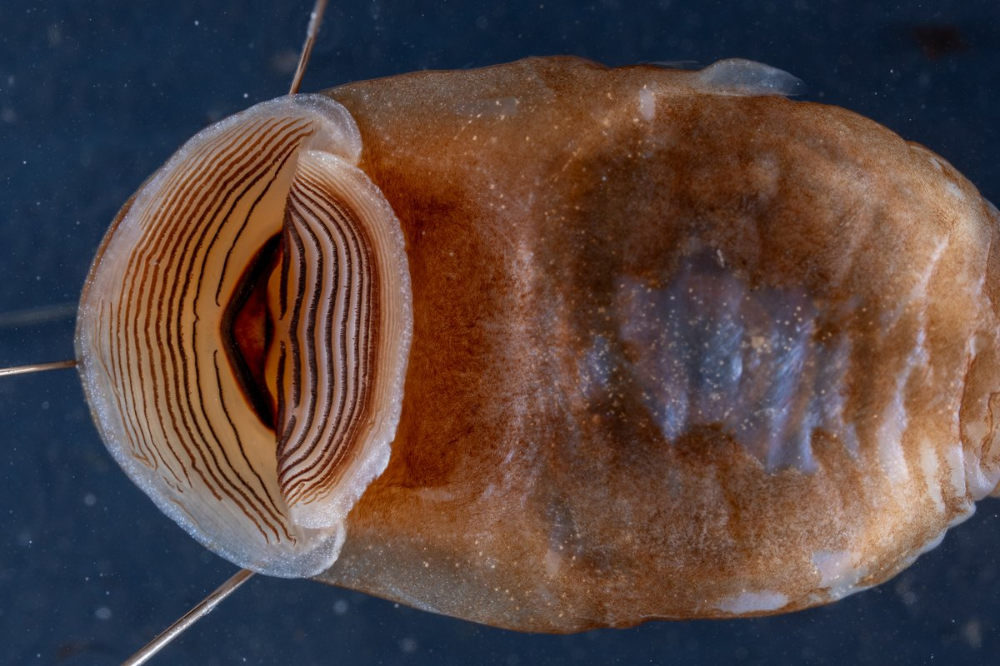
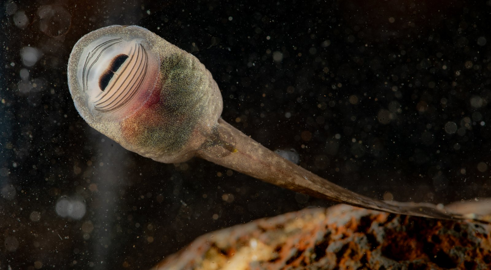
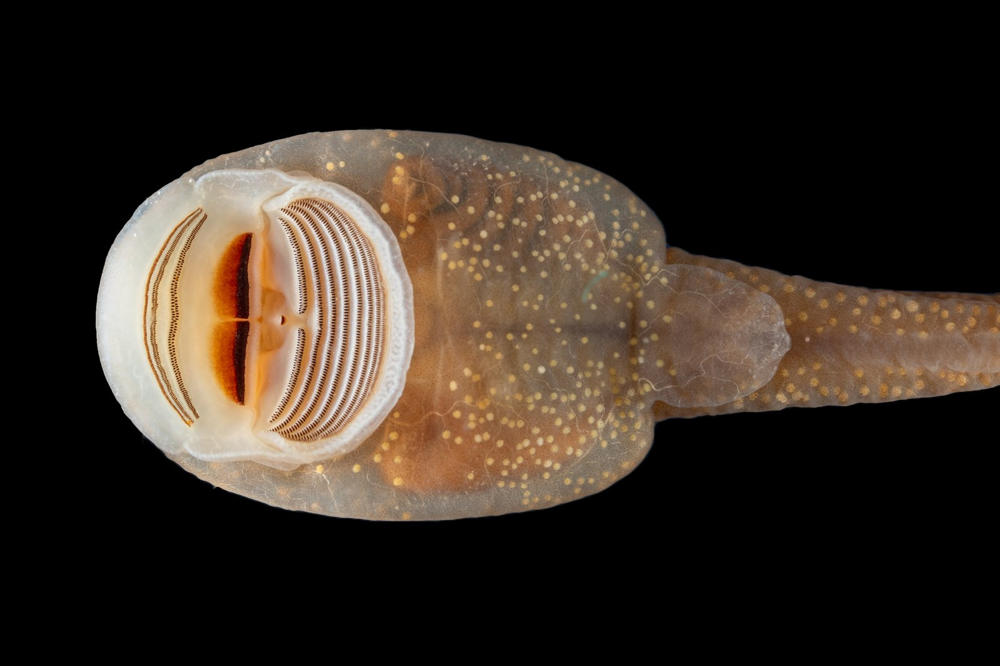

I love tadpoles of all shapes and sizes, but I have a special fondness for a certain kind of tadpole with an extra-large sucker mouth. These *suctorial* tadpoles (suctorial just means built for sucking, or in this case, for holding on by suction) are generally stream specialists, living only in fast-flowing streams where they use their large mouths to attach to rocks and graze on algae only they can reach.

## Where do you find suctorial tadpoles?

Suctorial tadpoles can be found all over the world, on every continent except Europe (and Antarctica). Suctoriality has evolved many, many times across different frog lineages. There are many different examples found across Central and South America, Africa, Australia, and different parts of Asia. Many of them have even given up their lungs, which I write about in [Why lose a lung?](../../research/why-lose-a-lung.qmd)

:::: {.diorama .pairs .long}
{fig-alt="A tadpole seen from below on a black background, with a huge oval sucker mouth taking up the front of its body"}

{fig-alt="A tadpole with small back legs seen from below, with a striped oral disc and a broad, flat belly"}

{fig-alt="A preserved tadpole seen from below, with a small mouth in front of a large round belly sucker, next to a scale bar"}

{fig-alt="A close-up of a preserved tadpole's underside, with an enormous oral disc covered in rows of dark toothlets"}
::::

In temperate North America, where I live, there is only one living suctorial lineage: the genus *Ascaphus*, the tailed frogs.

## Meet *Ascaphus*

{fig-alt="A live tadpole seen from below against a dark background, its round sucker mouth pressed flat, with a rock below"}

*Ascaphus* is a really remarkable group of frogs with plenty of interesting adult characteristics (including their [tails](https://amphibiaweb.org/lists/Ascaphidae.shtml)), but for me, the most interesting thing about them is their tadpoles, of course!

*Ascaphus* tadpoles are just as remarkable. They have a very large suction cup for a mouth, called an oral disc, with two large rasping plates made of keratin and then many rows of very small, keratinous toothlets.

{fig-alt="Close-up of a tadpole's underside showing a large round oral disc with a dark central beak and many fine, dark rows of tiny teeth"}

Their skulls are also really bizarre, looking almost nothing like any other tadpole, instead built to support large suction muscles and their large oral disc.

```{=html}
<div class="model-compare">
  <div class="model-panes">
    <figure class="model-pane">
      <div class="model-stage" data-src="../../assets/models/ascaphus-truei-chondrocranium.bin" role="img" aria-label="Rotatable 3D model of the cartilage skull of a tailed frog tadpole"></div>
      <figcaption><em>Ascaphus truei</em> <span>tailed frog, suctorial</span></figcaption>
    </figure>
    <figure class="model-pane">
      <div class="model-stage" data-src="../../assets/models/natalobatrachus-bonebergi-chondrocranium.bin" role="img" aria-label="Rotatable 3D model of the cartilage skull of a Kloof frog tadpole"></div>
      <figcaption><em>Natalobatrachus bonebergi</em> <span>Kloof frog, a more typical tadpole</span></figcaption>
    </figure>
  </div>
  <div class="model-bar">
    <span class="model-hint">Drag to rotate. Click, then scroll to zoom (or pinch).</span>
    <button type="button" class="model-reset">Reset view</button>
  </div>
  <p class="model-error">The 3D models need a browser with WebGL turned on.</p>
</div>
<script type="module" src="../../assets/js/model-viewer.js"></script>
```

::: {.model-caption}
The skull of a tailed frog tadpole (left) next to the skull of a more typical tadpole (right). A tadpole's skull is almost entirely cartilage, which is why it's called a *chondrocranium*. Both are shown at the same scale, and they turn together so you can compare them from any angle.
:::

## Where can you find *Ascaphus*?

*Ascaphus* tadpoles are endemic to (only found in) the temperate Northwestern forests of California, Oregon, Washington, Idaho, Montana, and British Columbia. There are two species: *Ascaphus truei*, found in the coastal forests and the Cascades, and *Ascaphus montanus*, found in the northern Rocky Mountains.

 (2020), used under a Creative Commons BY-NC license.](../../assets/images/education/ascaphidae-range-map-amphibiaweb.jpg){fig-alt="Map of the Pacific Northwest of North America with green shading along the coast from northern California to British Columbia and a second patch inland in Idaho, Montana, northeastern Oregon and southeastern Washington"}

Both species exclusively breed in high quality streams in good, healthy forest. Their tadpoles, [like many suctorial tadpoles](https://www.researchgate.net/publication/379862165_Habitat_and_respiratory_strategy_effects_on_hypoxia_performance_in_anuran_tadpoles), are quite sensitive to changes in water quality and especially temperature and oxygen levels. In one part of Montana, for example, *Ascaphus* tadpoles have only been found in streams cooler than about 16 °C (61 °F). For this reason, *Ascaphus* is a very good indicator species: its presence indicates a forest and stream are healthy, while their disappearance means bad things to come.

*Ascaphus* tadpoles can live for many years as a tadpole, with some of the longest recorded larval periods of any frog ([up to 4 years!](https://amphibiaweb.org/species/2049)), though it is usually more like 2 or 3. Even then, they're in no rush to grow up: in Montana, tailed frogs [don't breed for the first time](https://fieldguide.mt.gov/detail_aaaba01020.aspx) until they're about 7 or 8 years old.
