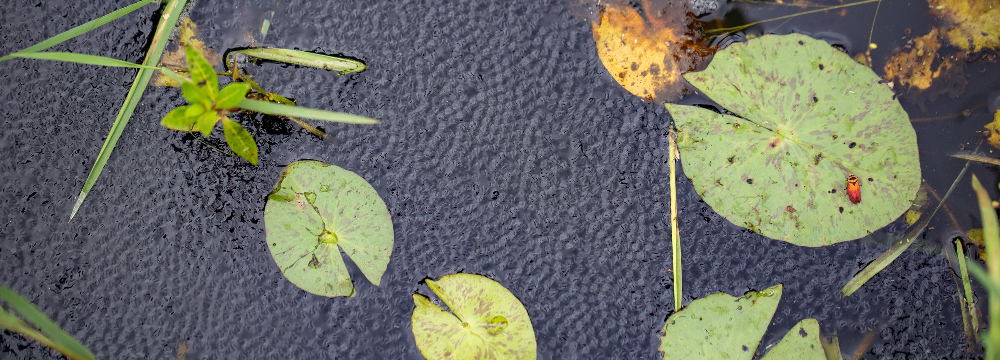
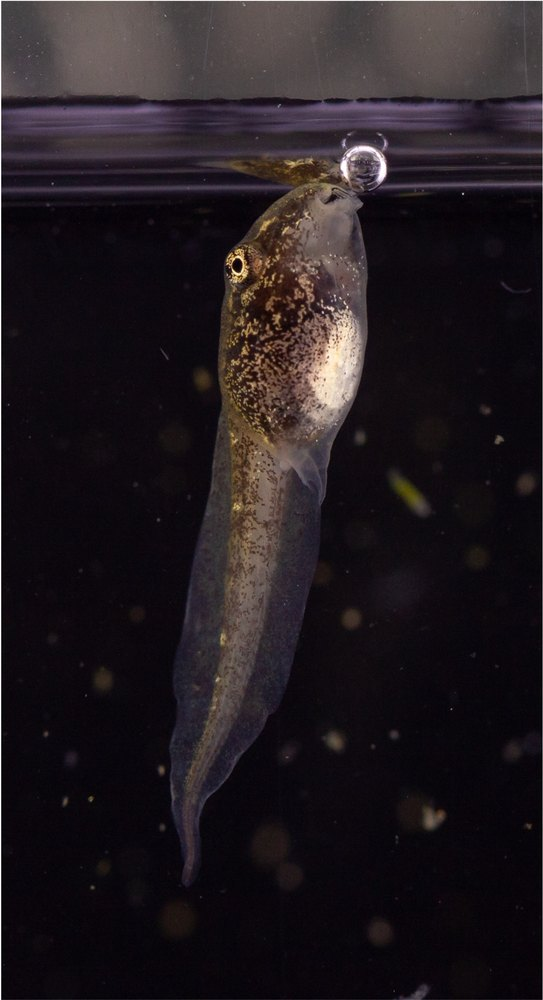
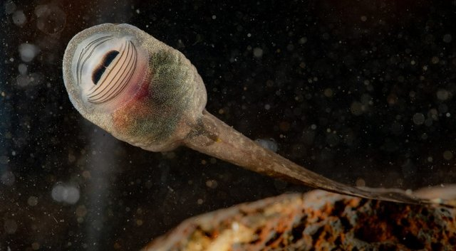
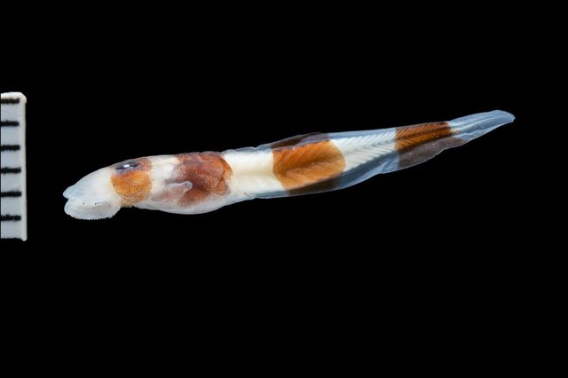
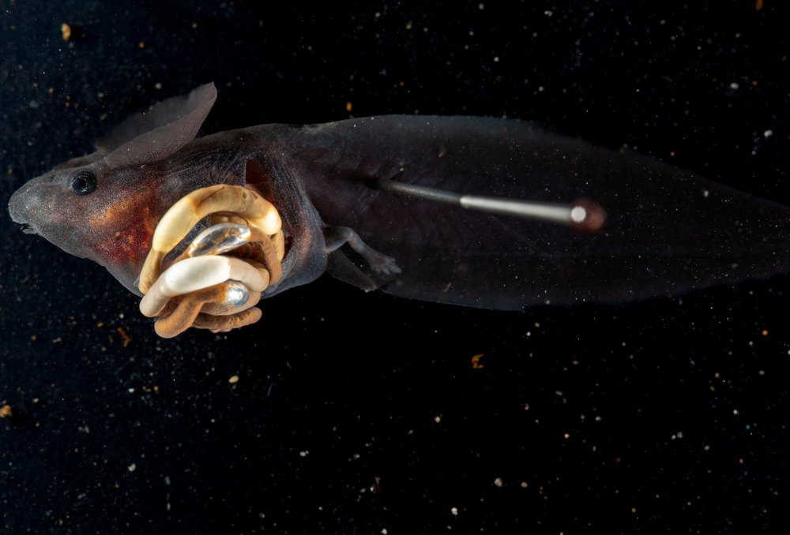
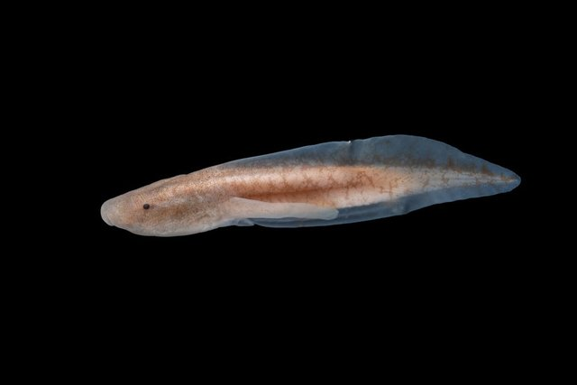

<!-- ===================== THE HOMEPAGE BANNER =====================
     THE PHOTO:  replace assets/home-banner.jpg with any wide image.
     THE TEXT:   the two lines inside .home-banner-text below. Just type over
                 them. The line starting with # is the big heading; the line
                 under it is the smaller line. Leave the ::: lines alone.
     ============================================================== -->
::: {.home-banner}
{fig-alt="Schismaderma carens tadpoles massed at the surface of a pond"}

::: {.home-banner-text}
# Jackson R Phillips

Scientist, Educator, and Photographer
:::
:::

::: {.hero}
::: {}
Hi and welcome, I'm Jack. If you're here, you're probably either interested in  my [research](research.qmd) or my photography. If you're looking for photos of rare tadpole specimens, look [here](tadpoles.qmd). If you're after wildlife shots, look [here](wildlife.qmd).

If you don't know me, I'm an evolutionary biologist with a special interest and expertise in tadpoles (larval frogs). I use tadpoles as models for understanding how the way you grow up (development) influences what you can evolve into.

If you're interested in my research into bubble-sucking tadpoles, lungless tadpoles, beakless tadpoles, suctorial tadpoles, or any of my other projects, please reach out.

::: {.keylinks}
[Curriculum vitae](cv.qmd){.primary}
[Google Scholar]()
[Get in touch](contact.qmd)
:::
:::

::: {.portrait}

:::
:::

## Research

::: {.preview}
[{fig-alt="A tadpole at the water surface with a bubble held at its mouth"}](research/do-tadpoles-have-lungs.qmd){.thumb-link}
[**Do tadpoles even have lungs?**](research/do-tadpoles-have-lungs.qmd)
Most tadpoles start breathing air within days of hatching, long before they grow legs. At the size they're doing it, though, breathing means fighting the surface of the water itself. Read on to see how they get around that, and what "bubble sucking" looks like in action.

[{fig-alt="A lungless tadpole clinging to rock in fast water"}](research/why-lose-a-lung.qmd){.thumb-link}
[**Why lose a lung?**](research/why-lose-a-lung.qmd)
While the vast majority of tadpoles have lungs and breathe air, some definitely do not. Read on to learn about the tadpoles that give up their lungs for a better chance at not getting swept away. Bonus: learn what the word "gastromyzophorous" means!

[{fig-alt="A preserved museum tadpole beside a scale bar"}](research/lost-and-found-in-the-museum.qmd){.thumb-link}
[**Lost and found in the museum**](research/lost-and-found-in-the-museum.qmd)
No, not like the Ben Stiller movie. One of my favorite parts of being a scientist is being around natural history museums. Read on to hear the story of how an unidentified tadpole turned into a new Genus of frogs.

[{fig-alt="A dense school of tadpoles breaking the surface of a pond"}](research/bubble-guts.qmd){.thumb-link}
[**Bubble guts**](research/bubble-guts.qmd)
Want to hear about the latest kind of air breathing?
Gut-breathing is all the rage, I hear.

[{fig-alt="A tadpole photographed against a black background"}](research/once-lost-gone-forever.qmd){.thumb-link}
[**Once lost, is a trait gone forever?**](research/once-lost-gone-forever.qmd)
For the more serious-minded reader, read on for a discussion of Dollo's Law and how my research into tadpole lungs and beaks may shed light on why some kinds of loss are more irreversible than others over evolutionary time.
:::

[All research writing →](research.qmd){.more-link}

<!-- ---------------------------------------------------------------------
  OPTIONAL "NEWS" SECTION. Uncomment when you have something to announce:
  a paper out, a talk, an award. Delete entries once they are more than
  about a year old; a stale news list looks worse than none.

## News

::: {.news}
**September 2026** — *Bubbleguts* accepted at *Ecology*.

**June 2026** — Talk at the Evolution Meeting in Cleveland.
:::

--------------------------------------------------------------------- -->
