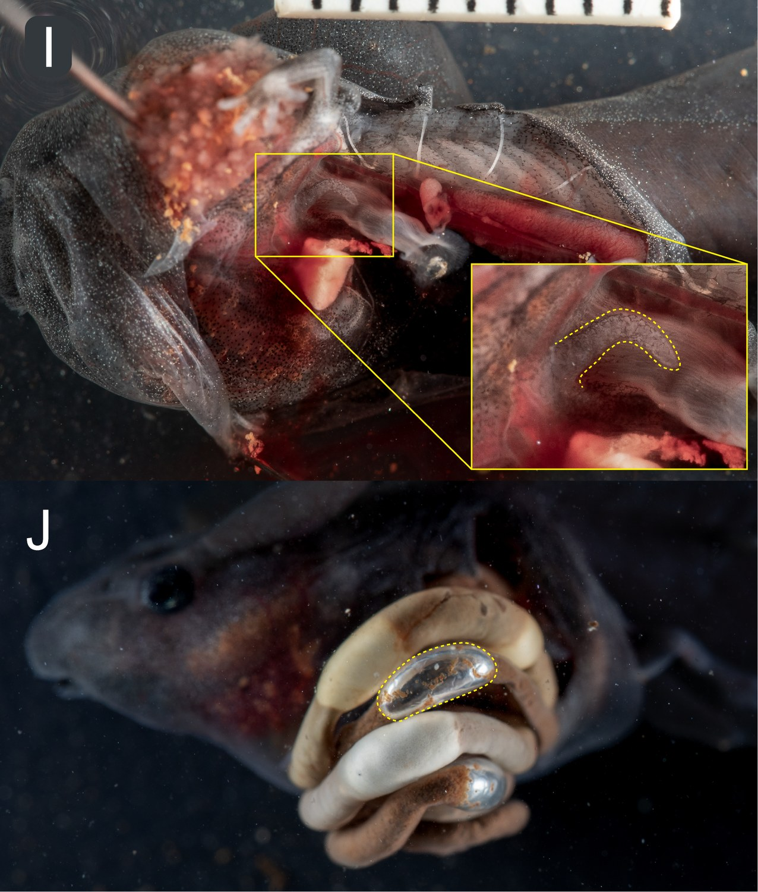
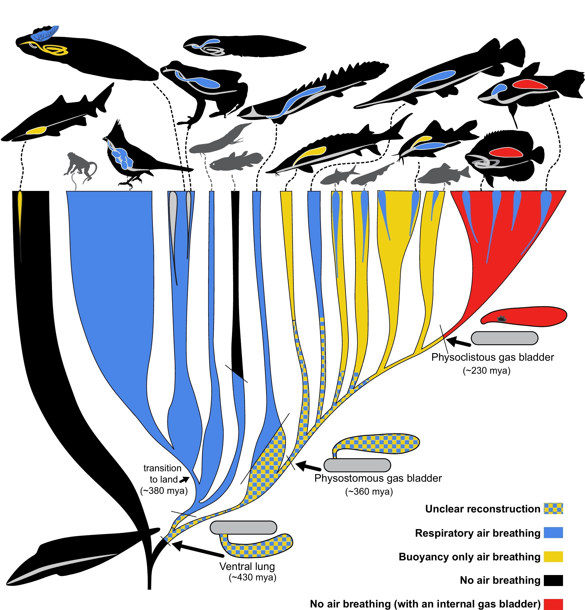

Last time, I told you about tadpoles that never develop working lungs, and
mentioned in passing that a couple of lungless species living in still water
had each independently evolved their own weird workaround: a patch of
well-vascularized skin standing in for the lung they never grew. One of
those was the African red toad, *Schismaderma carens*, with its odd,
vein-laced fold of skin across the top of the head.

It turns out that crest was not the interesting part.

## A pond full of tadpoles, breaking the surface

A few years ago, my colleague Molly Womack and I were watching a deep,
roadside pond in Limpopo, South Africa, when we noticed something moving in
the water. Huge, roughly spherical schools of tadpoles, each one thirty
centimeters or so across, were periodically rising toward the surface as a
unit, then sinking back down. With a long lens, we could see they were
*Schismaderma carens*, easy to identify even at a distance by that
distinctive head crest. And when a school reached the surface, tadpole after
tadpole broke through headfirst, mouths open, in exactly the kind of breach
I described in the very first post on this site.

::: {.video-figure}


**A school of tadpoles, all coming up for air at once, then sinking back down**
Filmed with a 600mm lens at a roadside pond in Limpopo, South Africa. There
were at least ten schools like this one visible at the same pond, each about
the size of a beach ball, all surfacing and submerging on their own
schedule.
:::

::: {.video-figure}
{fig-alt="A dense school of tadpoles breaking the surface of a pond, each with its head crest visible above the water"}

**A closer look, mid-breath**
The same behavior, paused: heads breaking the surface, mouths open, crests
just visible.
:::

Taken alone, this isn't shocking. Plenty of tadpoles breathe air, and I've
already spent two posts on this site making that case. But *Schismaderma* is
a toad, and toad tadpoles (family Bufonidae) are one of the lineages that
lost their lungs outright, and, as I explained last time, never got them
back. A lungless tadpole surfacing to gulp air shouldn't be possible. So we
did what any reasonable person would do: we caught some and cut them open.

## Breathing, without a lung to breathe into

Here is what a completely ordinary air breath looks like up close, filmed
in a different tadpole species (*Spea intermontana*) for comparison. Mouth
open, straight up through the surface, gulp, done.

::: {.video-figure .half}


**An ordinary air breath, from a tadpole with ordinary lungs**
*Spea intermontana*, filmed for comparison. Visually, this is exactly what
the *Schismaderma* school above was doing. The only difference is that
toad tadpoles are not supposed to have anything to fill.
:::

::: {.video-pair style="--cols: 0.88fr 1.08fr"}
<!-- column widths track each image's shape (788x900 and 900x832) so the two
     finish the same height; delete the style to go 50/50 -->
::: {.video-figure}
{fig-alt="A tadpole seen from below, its head held flat against the underside of the water's surface"}

**Held against the surface, seen from below**
The same posture from underneath, with the crest flat against the underside
of the surface film.
:::

::: {.video-figure}
{fig-alt="Close-up of tadpoles packed at the surface of a pond, one breaking through headfirst with its mouth at the air"}

**And in the pond, at close range**
One tadpole breaking through headfirst out of the crowd, mouth at the air.
:::
:::

Ten fresh dissections confirmed what the family history predicted: no
functional lungs. Small, undeveloped buds, exactly where you'd expect a
proper lung to be, and nothing more.

What we did not expect was what else was in there. Running the entire length
of each tadpole's long, coiled gut, from just behind the mouth all the way
to the vent, was a series of separate air bubbles, evenly spaced like beads
on a string.

::: {.video-figure}
{fig-alt="Dissection photos: (I) a Schismaderma tadpole's small, undeveloped lung bud outlined in yellow, and (J) a distinct air bubble outlined in yellow inside the coiled gut"}

**Exhibit A: no lung. Exhibit B: an awful lot of air, somewhere else**
Top: the lung bud (dashed outline), present but tiny and clearly
non-functional. Bottom: one of several distinct air bubbles (dashed outline)
sitting inside the gut itself.
:::

That spacing and regularity is what convinced us this was swallowed air and
not a byproduct of digestion (gut microbes produce gas too, but not in
neat, evenly sized, evenly spaced bubbles). Combined with tadpoles visibly
surfacing and gulping at the air-water interface, the conclusion was hard to
avoid: these tadpoles were breathing air into their gut.

Gut air breathing is not unheard of in the animal kingdom. A handful of
fishes, and even one shark, do something similar. But it had never been
documented in a tetrapod before, and it is a genuinely strange thing for a
tadpole to do, because these tadpoles already have a perfectly good,
unrelated air-breathing structure sitting right on top of their heads.

## Two air-breathing systems, one animal, and neither one is a lung

This is the part I find hard to get over. *Schismaderma* tadpoles have not
one but two independently evolved ways of dealing with air: the vascular
head crest from the last post, and now a gut full of swallowed bubbles.
Neither is a lung. And when those same tadpoles grow up, they'll go on to
breathe with ordinary frog lungs their whole adult lives, just like every
other toad. The lung program never left. It's just switched off for an
entire life stage that has, apparently, found two better options.

We only saw crest-pressing behavior under a specific set of conditions.
During the day, when dissolved oxygen in the pond was reasonably high
(about 50%), tadpoles formed loose, roving schools that moved through the
water and surfaced now and then. Early in the morning, after oxygen had
crashed overnight to around 9%, we found something different: those same
schools had packed together into dense surface mats, every tadpole pressed
crest-first against the underside of the air, holding that position for
minutes at a stretch.

::: {.video-figure}
{fig-alt="Close-up of several tadpole heads at the water's surface, each showing a dense network of red blood vessels across a fold of skin on top of the head"}

**The crest, doing its job**
Each of those red, branching lines is a blood vessel, sitting directly
against the underside of the water's surface film to pull oxygen out of the
thin, well-oxygenated boundary layer where air meets water.
:::

What stood out was how effortless it looked. A typical toad tadpole is
negatively buoyant. Left alone, it sinks, and staying at the surface means
actively swimming there and holding position with its tail. These tadpoles
just... stayed. No visible propulsion, no obvious effort, sometimes for
minutes on end.

## So maybe the gut air isn't for breathing at all

Here's the hypothesis we landed on: the gut bubbles aren't there for gas
exchange. They're there for buoyancy, and their job is to make the crest's
job easier.

A little basic math backs this up. Based on the weight of preserved tadpoles
and the size of the bubbles we could measure from photographs, it would only
take something like four to seven swallowed bubbles to bring a tadpole to
neutral buoyancy, effectively canceling out its own weight in water. One of
our dissection photos above shows five distinct bubbles running down just
one side of the gut. If a tadpole is carrying that much air, it doesn't need
to swim to stay at the surface. It just floats there, crest pressed against
the air, breathing passively for as long as it wants.

A few other clues point the same direction. When we exposed tadpoles to
low-oxygen water in the lab, they swam straight to the surface and stayed
there indefinitely, but they did not gulp air the way a lunged tadpole
does under the same stress (a classic test for whether air-breathing is
serving a respiratory function, which I described using this exact
experiment in the last post). A closer look at gut tissue under a scanner
also didn't turn up the kind of extra blood vessels you'd expect if the gut
itself were doing serious gas exchange, the way it does in a handful of
air-breathing catfish. Buoyancy control, not lung-style respiration, best
fits what we're seeing.

Bufonid tadpoles also tend to be toxic and foul-tasting, for what it's
worth, which might be exactly what lets *Schismaderma* get away with parking
itself at the surface, an easy target for anything that eats tadpoles, for
minutes at a time without becoming lunch.

## What the very first air-breathers might have looked like

This is the part where a weird toad tadpole in a South African roadside
pond connects to a much bigger question: how did any vertebrate first learn
to breathe air, over 400 million years ago?

Most of what we know about the origins of vertebrate air breathing comes
from fish that already had a pre-existing air-filled organ, usually a gas
bladder inherited from way back, and then repurposed it for something new.
That's a useful comparison, but it isn't quite the same experiment as the
original one, because those fish never had to solve the harder problem:
getting air into a body that has no air-filled space in it at all.

*Schismaderma* had to solve exactly that problem, from scratch, using
whatever was available. It didn't inherit a bladder or a spare lung. It
just started swallowing air into an ordinary gut, the same organ system
where the very first vertebrate lungs are thought to have originated as
simple pouches, hundreds of millions of years ago. In that sense, *Schismaderma*
tadpoles might be a decent working model for what those very first
air-breathing steps looked like, long before anything we'd call a lung
existed: a plain digestive tract, some swallowed air, and buoyancy as the
first payoff, with any respiratory benefit arriving later, if at all.

::: {.video-figure}
{fig-alt="Phylogenetic diagram showing the evolution of air breathing across vertebrates, color-coded by respiratory, buoyancy-only, and non-air-breathing lineages, with a lungless, gut-breathing Schismaderma tadpole marked partway up the tree"}

**A family tree of air, and all the different places it ended up**
Blue branches breathe air to help them breathe (in the usual sense). Yellow
branches breathe air purely for buoyancy. *Schismaderma* (small silhouette,
center-left) is unusual for having lost its ancestral lung, then re-evolved
air breathing anyway, splitting the job between a crest built for gas
exchange and a gut full of bubbles built for floating.
:::

It's a small case study, one tadpole species in one pond, but it's a rare
opportunity to watch air breathing get reinvented from nothing, in real
time, in a lineage we can still study today. And it leaves an obvious
question hanging over everything I wrote in the last post: if lungs, once
lost, never come back, why did this tadpole go to the trouble of
re-evolving air breathing at all, just through a different door? That's a
question about how reversible loss really is, and it deserves its own post.

---

*Phillips, JR and MC Womack. Bubble-guts: re-evolution of air breathing in a
lungless tadpole. Submitted to* Ecology *(The Scientific Naturalist),
currently in revision. I'll swap in the full citation once it's out.*
