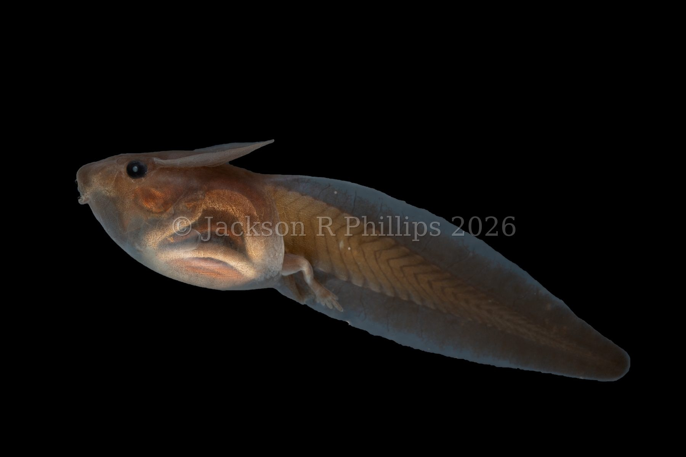
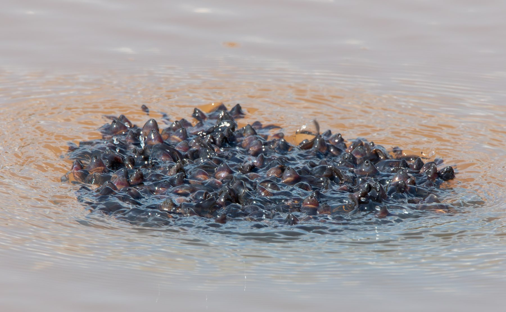
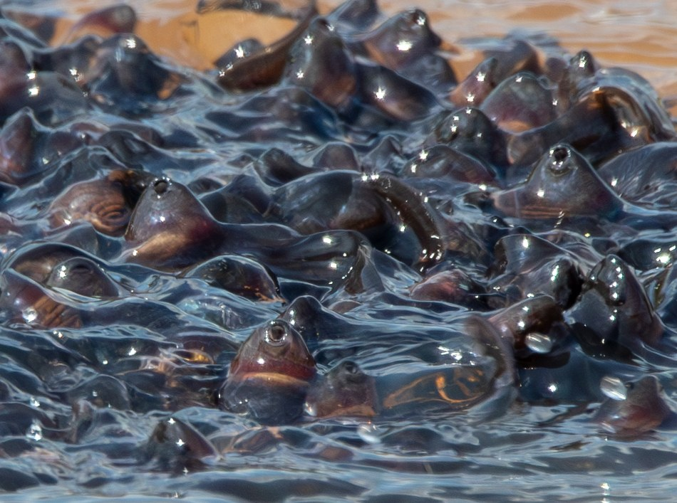
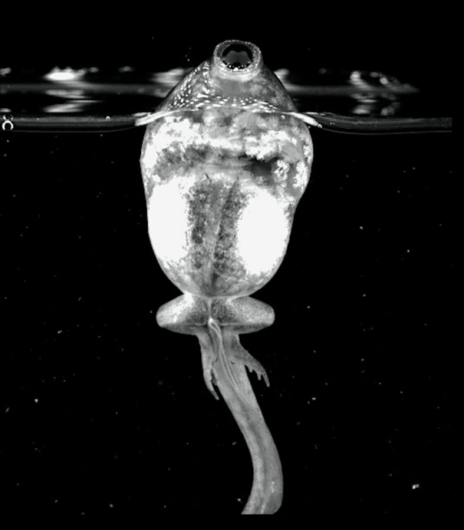
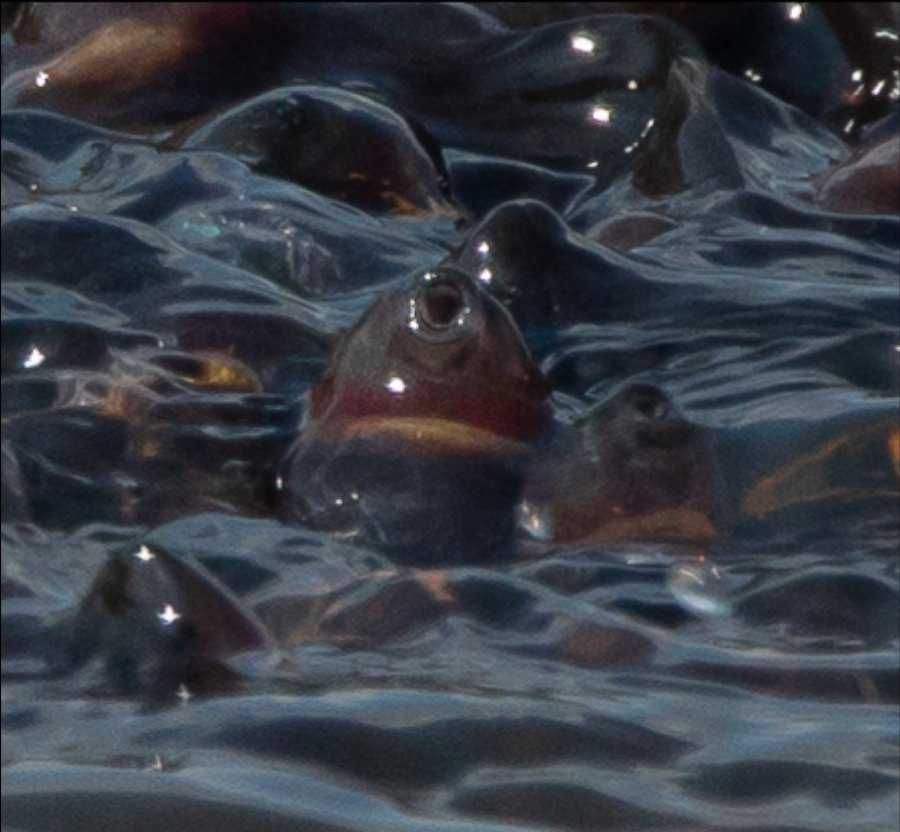
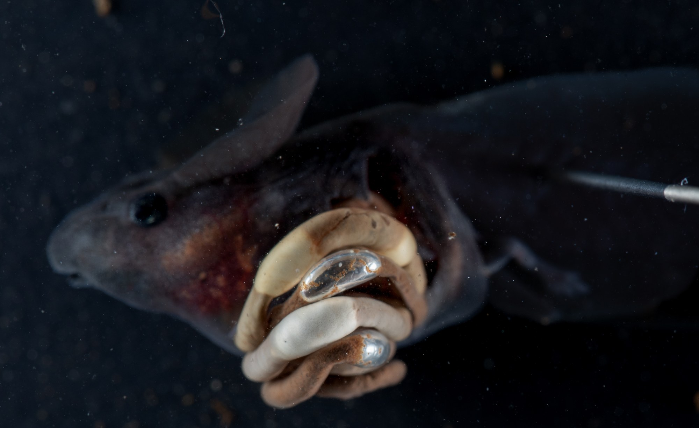

In [this post on lungless tadpoles](why-lose-a-lung.qmd), I wrote about tadpoles that never develop working lungs, and I finished by explaining that once lost, lungs have never returned. 

While that is technically true, there is one kind of weird case.

## Looking for re-evolutions of lungs

You see, after studying lungless tadpoles for a while, there was one species that just never made any sense to me. Its tadpole was lungless (I checked a specimen to be sure), but it was specialized to live in low oxygen habitats. In those low oxygen habitats, it supposedly used a respiratory crest on its head to get oxygen from the surface. This crest is really remarkable, even in preserved specimens.

::: {.video-figure}
{fig-alt="A preserved Schismaderma carens tadpole in lateral view against a black background, showing a broad fin-like crest rising from the top of its head"}

**Even preserved, the crest is hard to miss**
Preserved *Schismaderma carens* tadpole
:::

But lungless bufonids are very negatively buoyant: how would a tadpole like that be able to press a crest against a surface without constantly swimming?

This species is *Schismaderma carens* the African red toad. In the austral summer of 2022-23, I spent several months in South Africa doing fieldwork. Most of that time was spent doing [this study](https://www.researchgate.net/publication/379862165_Habitat_and_respiratory_strategy_effects_on_hypoxia_performance_in_anuran_tadpoles) looking at different respiratory performance of lunged and lungless tadpoles in ponds and streams, but I also was looking for *Schismaderma* tadpoles in the field. 

While in the field, I saw several amazing behaviors. When you see *Schismaderma* tadpoles in the field, they're usually in dense schools that look like dark balls in the water. During the day, these balls are out about, moving constantly through the water.

When we went back to the same ponds in the early morning, however, we found that the various schools had collapsed into a much larger sheet of tadpoles that covered the surface of the small pond. Every single tadpole had its crest pressed up against the surface, just like people had hypothesized. Why? Oxygen levels crash overnight in many ponds, because photosynthesis stops. With such low oxygen levels, these lungless tadpoles did indeed seem to be using their headcrests for respiration. 

INSERT SCHIS VIDEO 1

And they just sat right at the surface, effortlessly! I'd never seen anything like it for a supposedly lungless tadpole. 

## Looking for breathing

As I kept traveling around South Africa for the project, I couldn't get *Schismaderma* out of my head. What were they doing? 

One day, while driving on a highway up in Limpopo, the most Northern, tropical province in South Africa, I spied a large roadside pond. I got out to take a look and quickly found evidence of several tadpole species along the edge. Further out in the water, I saw what I thought were seveal large fishes, but then I realized they were actually schools of tadpoles: *Schismaderma*!

I pulled out my birding lens and tried to get some pictures of the behavior, including this series:

::: {.video-figure}


***Schismaderma* tadpoles schooling**
Filmed with a 600mm lens at a roadside pond in Limpopo, South Africa. There
were at least ten schools like this one visible at the same pond, each about
the size of a basketball.
:::

When I got the pictures back, I saw something on the back of my camera I'll never forget.

::: {.video-figure}
{fig-alt="A dense school of tadpoles breaking the surface of a pond, each with its head crest visible above the water"}

**What do you see?**
:::

Need a closer look?

::: {.video-figure}
{fig-alt="Close-up of a dense mass of tadpoles at the water's surface, each head crest breaking through as a smooth dark bump, a few eyes visible above the waterline"}

**A closer look**
:::

Was that air breathing?? It sure looked like it; check it out compared to a regular tadpole breathing air into lungs.

::: {.video-figure .half}


***Spea intermontana* tadpole breathing air**
*Spea intermontana*, filmed for comparison. Visually, this is exactly what

:::

::: {.video-pair style="--cols: 0.88fr 1.08fr"}
<!-- column widths track each image's shape (788x900 and 900x832) so the two
     finish the same height; delete the style to go 50/50 -->
::: {.video-figure}
{fig-alt="screenshot of Spea intermontana tadpole breathing air"}

**Screenshot of the Spea video showing the breathing moment*

:::

::: {.video-figure}
{fig-alt="Close-up of tadpoles packed at the surface of a pond, one breaking through headfirst with its mouth at the air"}

**Closeup of one *Schismaderma* tadpole**
:::
:::

That sure looked like breathing to me, but how to be sure? And where was the air going?

We grabbed some of the tadpoles using a very long net handle (and nearly losing [Gary](https://www.nicolauecology.com/) into some pretty gross water in the process). I brought them back to our makeshift research station for the night, where I euthanized a tadpole and opened it up. 

The title might have given it away, but I was absolutely blown away.

Instead of lungs, the tadpoles' guts were full of... 

## Bubbles!

::: {.video-figure}
{fig-alt="A dissected tadpole's coiled gut pinned open, showing a row of silvery, bead-like air bubbles spaced evenly along its length"}

**Beads on a string**
:::

Running the entire length of each tadpole's long, coiled gut was a series of air bubbles, evenly spaced like beads on a string. 

## Why breathe?

So why are these tadpoles breathing air? Well, I think it's for buoyancy. I think they fill their guts with air so they can swim in the middle and top of the water column. Without lungs, they would otherwise be stuck on the bottom of the water, and breathing air into the guts lets them use their vascular crest for respiration.

::: {.video-figure}
{fig-alt="Close-up of several tadpole heads at the water's surface, each showing a dense network of red blood vessels across a fold of skin on top of the head"}

**The respiratory crest in action**
Each of those red, branching lines is a blood vessel, sitting directly
against the underside of the water's surface film to pull oxygen out of the
thin, well-oxygenated boundary layer where air meets water.
:::

Now, this is a mouthful, but that essentially means that *Schismaderma* tadpoles have evolved a new form of air breathing to facilitate gas exchange with a totally different respiratory organ. So weird, right?

The reason we think this, is that *Schismaderma* tadpoles don't respond to low oxygen by breathing air, they respond by coming up to the surface and pressing their crests. This makes sense, since if they just kept breathing, the guts would be totally full of air and they'd be way too buoyant to swim properly. Instead, they breathe just enough to stay at the surface effortlessly.

This matters because the surface layer of water, even really hypoxic, gross water, is always perfectly oxygenated from the air that it's touching. This boundary layer is often super thin, just a few molecules thick, but that's where the crest is touching. As they sit there, the tadpoles suck water in and out of the nostrils, moving water across the crest, just like water is pulled across a gill. 

INSERT SCHIS VIDEO 2

What stood out was how effortless it looked. A typical toad tadpole is
negatively buoyant. Left alone, it sinks, and staying at the surface means
actively swimming there and holding position with its tail. These tadpoles
just... stayed. No visible propulsion, no obvious effort, sometimes for
minutes on end.

## Breathing for buoyancy

A little basic math backs up the buoyancy idea. Calculating off the size and weight of the tadpoles we collected, the bubbles we observed would make the tadpoles neutrally buoyant. 

---

*Phillips, JR and MC Womack. Bubble-guts: re-evolution of air breathing in a
lungless tadpole. Submitted to* Ecology *(The Scientific Naturalist),
currently in revision. I'll swap in the full citation once it's out.*
