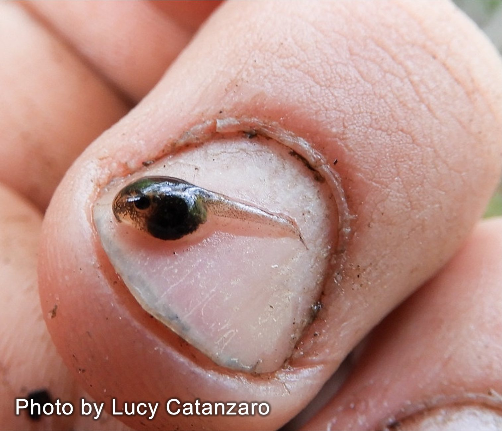
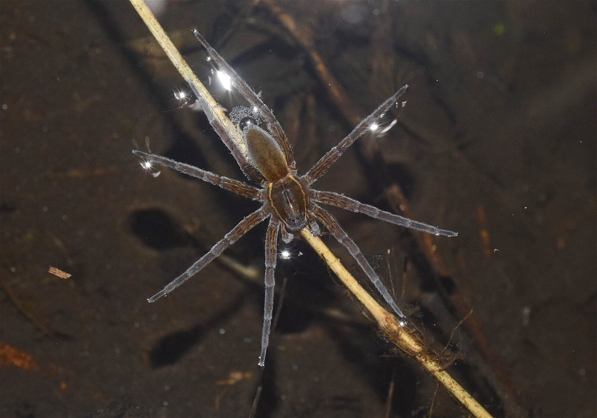
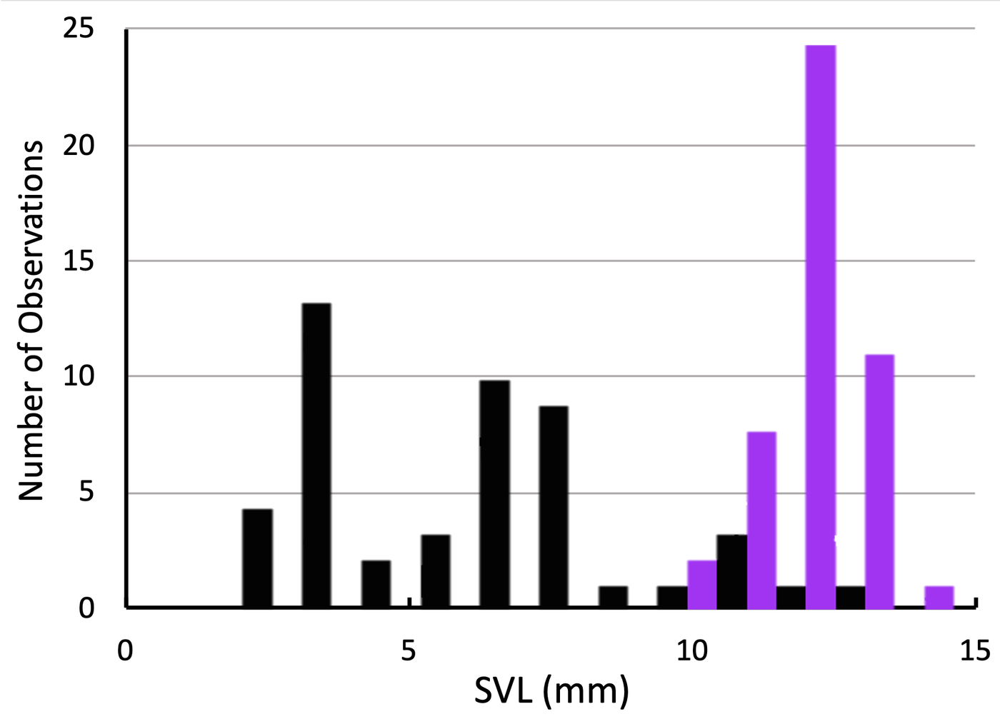

Just ask any frog-obsessed kid, and they'll tell you: tadpoles don't have lungs, they have gills! Well, I'm here to tell you, as a former frog-obsessed child, that pretty much everyone is wrong about tadpole lungs. 

Most tadpoles do have lungs, and they start using them almost immediately.
Across the species I've looked at, tadpoles start filling their lungs with
air within three or four days of hatching, at body lengths of about three
millimeters (smaller than a grain of rice). 

::: {.video-figure .half}
{fig-alt="A hatchling grey tree frog tadpole resting on a human fingernail, roughly the size of a grain of rice"}

**A tiny tadpole**
Young tadpoles are extremely small: this young grey tree frog (*Hyla versicolor*) tadpole is barely larger than a grain of rice. Photograph by Lucy Catanzaro.
:::

This is interesting, not just because it is so early, but because they are so small. Any animal at that size experiences water in a totally different way than you or I do. For them, tiny forces, like surface tension, are gigantic obstacles to overcome. 

## What is surface tension?

Surface tension exists because water molecules are sticky. They'd rather bond
to each other than to almost anything else, which is why water beads up into
droplets on a plastic sheet instead of spreading out flat. In the middle of a water droplet, pool, or pond, each water molecule is pulled equally in every direction by its neighbors, so it all cancels out. But right at the surface, where there's air
instead of water on one side, the molecules start to pull sideways and down on each other more than usual, and the whole surface pulls taut, like a stretched, elastic skin.

For animals light and small enough, that skin acts like solid ground:

::: {.video-figure .half}

**A fishing spider standing on the surface film**
Look closely at each foot and you can see the surface dimple downward without
breaking, exactly the same elastic skin that gives water striders and fishing spiders a floor to stand on.
:::

But there's also a flip side of surface tension, which most people never think
about. Tiny aquatic animals experience surface tension as a ceiling.

::: {.video-figure}


**A snail walks along the underside of the surface tension**
A snail walks along the underside of the surface, using the tension as a physical surface to travel along.
:::

For an animal our size, that ceiling is almost unnoticeable. We break through it
with ease when we come up from a dive (although surface tension does have real consequences inside our bodies and lungs, but that's a different story). 

For a tadpole just days out of the egg, the size of a grain of rice, that ceiling is a genuine, physical barrier relative to its size.

Watch a young tadpole try to breathe at the surface:

::: {.video-figure}


**A small green frog tadpole (*Rana clamitans*) tries to breach**
It swims up to the surface, mouth-first, but the surface doesn't break. Instead, it stretches under the impact and springs back, sending the tadpole down without a mouthful of air.
:::

## We started with big tadpoles, which are much easier to film. How do they breathe?

We found that large tadpoles (a couple inches long) breathed a lot like whales, people, and other animals at least that big. 

::: {.video-figure}


**An older, much larger *Rana clamitans* tadpole successfully breaches**

A breach is breath more similar to what whales do: breathing by coming up quickly through the surface tension and exchanging air while briefly above the surface.
:::

## Bubble-sucking

But what about before then? I've now told you that tiny tadpoles breathe air, but they are also too small to overcome surface tension.

If a tadpole can't break through the surface, how does it breathe at all?

It turns out tadpoles, along with a handful of other small, slow-moving
aquatic animals, perform a previously undocumented kind of air breathing.
Working with colleagues at the University of Connecticut, I filmed this behavior in slow motion, described the mechanics for the first time, and gave it a name:
bubble sucking.

::: {.video-pair style="--cols: 1.24fr 0.73fr"}
<!-- column widths track each clip's shape (1152x928 and 620x848) so the
     two players finish the same height; delete the style to go 50/50 -->
::: {.video-figure}


**A young *Rana sylvatica* tadpole bubble sucking**
:::

::: {.video-figure}

**A small *Xenopus laevis* tadpole bubble sucking**

:::
:::

To bubble suck, a tadpole first swims up and presses its mouth to the
underside of the surface and starts to suck on it like a rock, holding itself in place. Instead of then trying to swim up and through the tension, the
tadpole sucks the surface itself downward, pulling a pocket of the air-water interface (a *bubble*) into its mouth. The bubble stays connected to the open air above, and the lungs (which were full before the breath began) empty mid-suck, allowing the air to be mostly refreshed. Once the mouth is full of air and the lungs are empty, the tadpole can simply close its mouth. That pinches the bubble off from the surface, and the air can then be squeezed through the glottis and into the lungs. The whole sequence, from attachment to a full breath, takes well under a second.

::: {.video-figure}


**A small *Xenopus laevis* tadpole bubble sucking**
Look closely and you can see each phase of bubble sucking. Watch the lungs empty mid-breath and then fill afterwards.
:::

We looked at breathing across development and found a statistical relationship between bubble-sucking and size that translated across species. Nearly every tadpole we looked at started breaching (not bubble sucking) at around the same size (~8 mm), suggesting that size might be the driving force here.

::: {.video-figure}
{fig-alt="Histogram of tadpole snout-vent length, with bubble-sucking breaths in black and breaching breaths in purple"}

**Statistical relationship between tadpole size and onset of breaching**
Black bars are bubble-sucking breaths, purple bars are breaches. Tadpoles' first breaths are usually bubble sucks, because they are too small to do anything else. As they get bigger, around 8 mm body length, they start to breach, and then quickly are almost always breaching when they breathe. 
:::

## Not just tadpoles

Once we knew what to look for, we started seeing bubble sucking in other small, aquatic animals that breathe air.

Hatchling salamander larvae, it turns out, bubble-suck in essentially the same
way tadpoles do. Pond snails, which breathe through a pulmonary siphon rather
than a mouth, also pull the surface down and pinch off a bubble. 

::: {.video-figure}


**A pond snail (*Physa heterostrophus*) bubble-sucking**
No mouth involved this time: the siphon does the same job, pulling the
surface down and sealing off a bubble before drawing it in.
:::

None of these animals are closely related. What they share is size: they're
all small and slow enough that the surface of the water is a real mechanical
obstacle rather than something to shrug off. Surface tension usually gets
treated as a minor curiosity, or as something only relevant to animals that
walk on top of the water, like water striders and fishing spiders. Our
results suggest it belongs in the same category as gravity or drag: a
physical constraint that has quietly shaped the evolution of a whole range of
small aquatic animals, and one that keeps getting solved independently, in
slightly different ways, wherever it comes up.

As tadpoles grow larger and stronger swimmers, most eventually outgrow the
problem entirely and switch over to breaching the surface normally, the way an
adult frog does. A few species, though, don't make that switch cleanly, and at
least one keeps bubble-sucking its entire larval life while doing something
even stranger with the mechanics of the breath itself. That, and how a tadpole
actually pumps air once it's inside, is worth its own post.

---
***Phillips, JR**, AE Hewes, MC Womack, and K Schwenk (2022). The mechanics of air breathing in African clawed frog tadpoles,* Xenopus laevis *(Anura: Pipidae).* Journal of Experimental Biology *225(10), jeb243102.*

*Schwenk, K and **JR Phillips** (2020). Circumventing surface tension:
tadpoles suck bubbles to breathe air.* Proceedings of the Royal Society B
*287(1921), 20192704. Covered by New Scientist, Popular Science and The
Scientist.*

