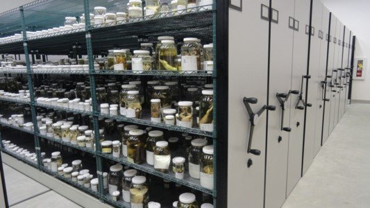
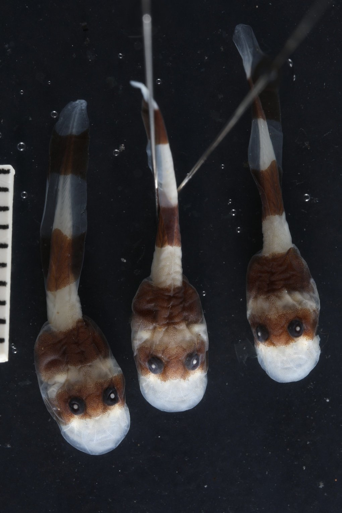
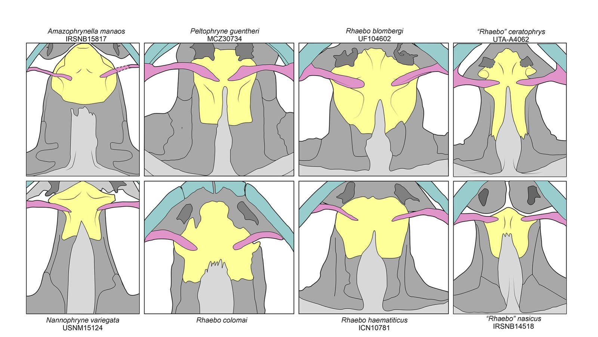
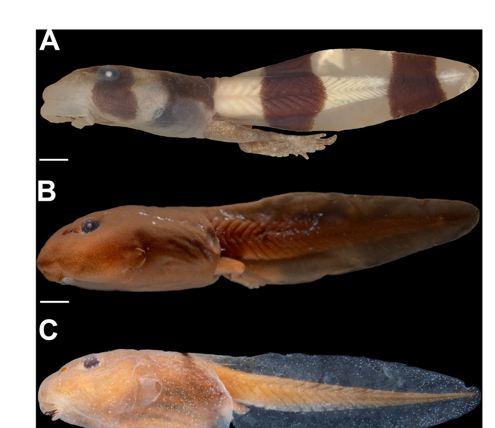
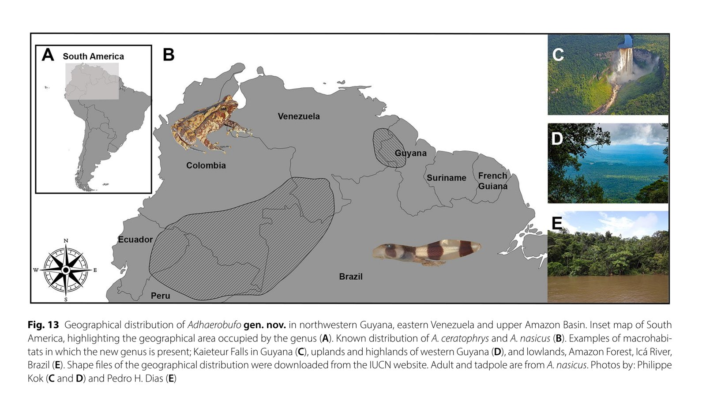

When you hear about species discovery, most people, especially those born in the US, probably think of a rugged explorer cresting over an alien horizon. Setting foot where no "man" has stepped before. This was never really true, but it has never been less true than today. More often, species are "discovered" in jars on shelves, deep in the recesses of natural history collections. 

This is one of those stories.

## Summer 2023, at the Smithsonian

I was in Washington, DC, at the Smithsonian's National Museum of Natural
History, working on a project. I was going through their tadpole collection to find tadpoles I wanted for a [project on lung loss](why-lose-a-lung.qmd).

Every time I visit a big collection like that, I always ask to take a peek at the "unidentified section". Nearly every collection has some version of this shelf, but tadpole collections tend to have *big* unidentified sections, since they can be really difficult to ID. 

::: {.video-figure}
{fig-alt="Rows of specimen jars on museum shelving at the Smithsonian's National Museum of Natural History"}

**A very ordinary-looking shelf**
Somewhere in rows like this one sits the next new species, already collected,
already preserved, and simply still waiting on the right person to take a
second look.
:::

Often these jars are full of tiny, nondescript tadpoles that may never be identified, but sometimes you find something really special. 

## Flashback to 2006

To explain what I found, I have to back up almost twenty years, to a
biologist named Dr. [Bruce Means](https://www.brucemeans.com/).

Bruce is a naturalist who has spent decades working in Guyana, a country on the northern part of South America. He works on the Pantepui, a region full of remote highlands and table-mountains ("tepui") in the Guiana Shield. It's some of the most-difficult terrain to reach in South America, and it keeps producing new species, genera, and even families because so few biologists have ever had
the chance to look closely at it. In 2006, during fieldwork on the slopes of
Mount Kopinang, Bruce collected some odd tadpoles from a fast-flowing
mountain stream. He didn't know exactly what they were, but he collected them
anyway, and deposited them at the Smithsonian. For that, I am very grateful.

::: {.todo}
FIGURE PLACEHOLDER: portrait of Dr. Bruce Means in the field (you used one in
the talk, but double-check you have the rights/his OK before it goes on the
public site, since it's a photo of a specific named person).
:::

After all, this is what I looked like in 2006, for reference, and I was in no position to be climbing Tepuis to find rare tadpoles:

::: {.video-figure}
{fig-alt="A young Jack Phillips holding a football on a beach in front of the Golden Gate Bridge, 2006"}

**Also 2006**
While Bruce was in a Guyanese stream collecting the tadpole that would
eventually get its own genus, I was busy learning football wasn't for me.
:::

After coming back from the field, that jar of tadpoles just sat there. Not lost, exactly. Just unidentified, and waiting.

## Some very strange tadpoles

Seventeen years later, I pulled that jar off the shelf. On its label, it just said "Anura: collected on Mount Kopinang, Guyana".

The tadpoles inside were striking: banded in dark chocolate brown and cream,
with an oral disc clearly built for sucking onto rocks in streams, not just grazing.

I knew, right away, that these tadpoles were were something special. They looked kind of like *Ansonia* tadpoles from Southeast Asia, but like nothing ever described from North of South America. So I called my friend Pedro, *the* expert on South American tadpoles, and asked what he thought. He agreed these tadpoles were something new. I emailed Bruce next, and so began a very fun year of DNA sequencing, phylogenetics, skull anatomy, and writing. 

::: {.video-figure}
{fig-alt="Three preserved banded tadpole specimens, pinned for photography, showing dark brown and cream coloration"}

**The tadpoles from the jar**
Striking banded coloration, and a mouth clearly built for clinging to rock in
current, not for the ordinary business of scraping algae off a leaf.
:::

It turned out, this wasn't a new species! The tadpoles' DNA closely matched a described species known as *Rhaebo nasicus*, an obscure toad first named in 1903. This species was very enigmatic, having been moved from genus to genus over the years, as none of them quite fit. 

## Really, *Rhaebo*?

The striking tadpole was the clue: this thing was no *Rhaebo*. The color pattern was unlike any other *Rhaebo* tadpole and the mouth and throat anatomy was totally wrong for the genus. Once we were looking, we also began to find characters in the adult skull that didn't fit with other *Rhaebo* toads. Even the larval ecology was off: *Rhaebo* species are generally pond-and-stream generalists, and this animal was a
specialized, sucker-mouthed torrent tadpole clinging to boulders in a
waterfall-fed creek.

::: {.video-figure}
{fig-alt="Illustrated comparison of the sphenethmoid skull bone across eight bufonid genera, showing the narrow condition in \"Rhaebo\" nasicus and \"Rhaebo\" ceratophrys compared to other Rhaebo species"}

**The skull bone that gave it away**
Fair warning: frog palate bones are a hard sell as a visual. But look at the
yellow shape (the sphenethmoid) in the bottom-right panel, "*Rhaebo*"
*nasicus*, next to *Rhaebo haematiticus* just to its left. Narrow versus wide.
That kind of difference, repeated across several bones, is what a taxonomist
actually means by "doesn't fit the genus."
:::

## *Adhaerobufo* gen. nov.

Along with phylogenetic evidence that nasicus was distinct from other *Rhaebo*, all this evidence convinced us that this tadpole deserved its own genus. So we gave it, and a close relative from the upper Amazon called *Rhaebo ceratophrys*, a new genus: *Adhaerobufo*.

The name comes from the Latin *adhaerens*, meaning adherent or clinging, and
*bufo*, toad. An adherent toad, named for its tadpole. Nearly everything that makes this group distinctive is happening in the tadpole stage.

::: {.video-figure}
{fig-alt="Three preserved tadpoles compared side by side: Adhaerobufo nasicus with bold dark bands, and two plain brown Rhaebo tadpoles for comparison"}

**Not exactly a subtle difference, once you line them up**
*Adhaerobufo nasicus* (top) next to two ordinary *Rhaebo* tadpoles,
*R. caeruleostictus* (middle) and *R. haematiticus* (bottom). Same general
toad-tadpole body plan, completely different mouth, body shape, and color.
:::

::: {.video-figure}
{fig-alt="Map of northern South America showing the distribution of Adhaerobufo in Guyana, Venezuela, and the upper Amazon basin, with photos of Kaieteur Falls and Amazon lowland forest"}

## Lost and found in the museum

Here's what I'd really love for people to take away from this.

Nobody set out to find a new genus of frog. Bruce  didn't know what he'd
collected in 2006, but still collected it. That's the unglamorous, essential side
of taxonomy: collecting and preserving things properly even when you can't
identify them yet, and trusting that eventually the right person will come
looking for that jar.

---

*Dias, PH, **JR Phillips**, MO Pereyra, DB Means, A Haas, and PJR Kok (2024).
The remarkable larval morphology of* Rhaebo nasicus *(Werner, 1903) (Amphibia:
Anura: Bufonidae) with the erection of a new bufonid genus and insights into
the evolution of suctorial tadpoles.* Zoological Letters *10, 17. Open
access.*
