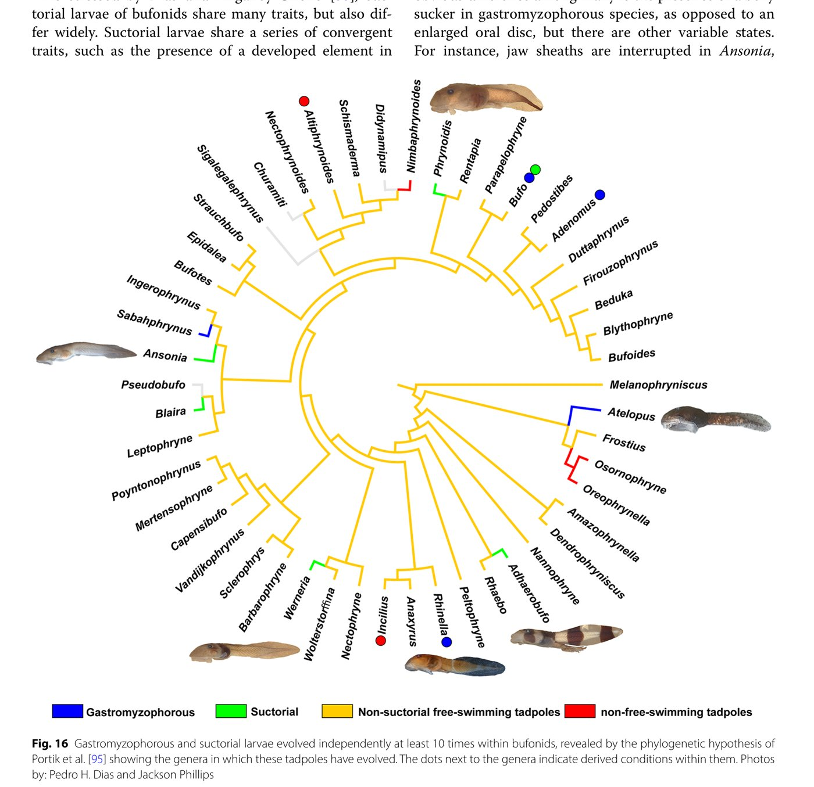

Not every new species gets discovered in the field. Some are discovered in a
cabinet, in a jar, under a label that just says "unidentified," years after
whoever collected it walked back out of the jungle.

This is one of those stories.

## Summer 2023, at the Smithsonian

I was in Washington, DC, at the Smithsonian's National Museum of Natural
History, doing something that sounds a lot less exciting than it turned out
to be: going through the museum's backlog of unidentified tadpole lots. Every
natural history collection has a version of this shelf. Adult frogs get
identified quickly, because someone can flip through a field guide and match
the pattern. Tadpoles are harder. A lot of species' tadpoles have never even
been described, so a jar of larvae that doesn't obviously match anything
often just gets a label reading "Bufonidae, gen. sp." and gets shelved,
sometimes for decades, waiting for someone who works specifically on
tadpoles to come along.

::: {.video-figure}
{fig-alt="Rows of specimen jars on museum shelving at the Smithsonian's National Museum of Natural History"}

**A very ordinary-looking shelf**
Somewhere in rows like this one sits the next new species, already collected,
already preserved, and simply still waiting on the right person to take a
second look.
:::

That's exactly the kind of jar I go looking for.

## Flashback to 2006

To explain what I found, I have to back up almost twenty years, to a
biologist named Dr. Bruce Means.

Bruce is a naturalist who has spent decades working in Guyana, particularly
in the Pantepui, the remote highlands and table-mountain ("tepui") country of
the Guiana Shield. It's some of the least-visited terrain in South America,
and it keeps producing new species because so few biologists have ever had
the chance to look closely at it. In 2006, during fieldwork on the slopes of
Mount Kopinang, Bruce collected some odd tadpoles from a fast-flowing
mountain stream. He didn't know exactly what they were. He preserved them
anyway, and deposited them at the Smithsonian, the way careful field
biologists do with anything that looks like it might matter later, known or
not.

::: {.todo}
FIGURE PLACEHOLDER: portrait of Dr. Bruce Means in the field (you used one in
the talk, but double-check you have the rights/his OK before it goes on the
public site, since it's a photo of a specific named person).
:::

Here's roughly what I looked like that same year, for reference, and for
what it's worth I was not yet doing anything useful with tadpoles:

::: {.video-figure}
{fig-alt="A young Jack Phillips holding a football on a beach in front of the Golden Gate Bridge, 2006"}

**Also 2006**
While Bruce was in a Guyanese stream collecting the tadpole that would
eventually get its own genus, I was doing this.
:::

Then the jar sat there. Not lost, exactly. Just unidentified, and waiting.

## Some very strange tadpoles

Seventeen years later, that jar is one of the ones I pulled.

The tadpoles inside were striking: banded in dark chocolate brown and cream,
with an oral disc clearly built for gripping, not just grazing. Genetic work
placed them, somewhat surprisingly, within *Rhaebo nasicus*, an obscure toad
species first named in 1903 from very little material and rarely collected
since. Case closed, more or less. A known species, just from a stream nobody
had sampled before.

::: {.video-figure}
{fig-alt="Three preserved banded tadpole specimens, pinned for photography, showing dark brown and cream coloration"}

**The tadpoles from the jar**
Striking banded coloration, and a mouth clearly built for clinging to rock in
current, not for the ordinary business of scraping algae off a leaf.
:::

Except it didn't quite sit right.

## Really, *Rhaebo*?

A few things kept nagging at us. The color pattern was unlike any other
*Rhaebo* tadpole on record. The mouth and throat anatomy looked wrong for the
genus. The skull, once we cleared and stained specimens and ran others
through a micro-CT scanner, was missing bone features that are supposed to be
diagnostic for *Rhaebo*. Even the ecology was off: *Rhaebo* species are
generally unremarkable pond-and-stream generalists, and this animal was a
specialized, sucker-mouthed torrent tadpole clinging to boulders in a
waterfall-fed creek.

::: {.video-figure}
{fig-alt="Illustrated comparison of the sphenethmoid skull bone across eight bufonid genera, showing the narrow condition in \"Rhaebo\" nasicus and \"Rhaebo\" ceratophrys compared to other Rhaebo species"}

**The skull bone that gave it away**
Fair warning: frog palate bones are a hard sell as a visual. But look at the
yellow shape (the sphenethmoid) in the bottom-right panel, "*Rhaebo*"
*nasicus*, next to *Rhaebo haematiticus* just to its left. Narrow versus wide.
That kind of difference, repeated across several bones, is what a taxonomist
actually means by "doesn't fit the genus."
:::

Individually, none of these differences would necessarily mean much. Animals
are variable, and a weird-looking population doesn't automatically deserve
its own genus. But once color, oral anatomy, skull anatomy, and ecology all
point the same direction, and once the molecular data confirms it's not
simply a variable population of an existing species, that combination is
usually a signal that you're not looking at *Rhaebo* at all. You're looking
at something *Rhaebo* has been mistakenly holding onto.

## *Adhaerobufo* gen. nov.

So we gave it, and a close relative from the upper Amazon called *Rhaebo
ceratophrys*, a new genus: *Adhaerobufo*.

The name comes from the Latin *adhaerens*, meaning adherent or clinging, and
*bufo*, toad. An adherent toad, named for the one trait that gives the whole
genus away: a tadpole mouth modified into a suction cup, built to hold on in
water that would otherwise sweep it downstream. It's a genus named after its
larvae, not its adults, which is unusual, but fitting: the adult frogs are
fairly unremarkable toads. Almost everything that makes this group
distinctive is happening in the tadpole stage.

::: {.video-figure}
{fig-alt="Three preserved tadpoles compared side by side: Adhaerobufo nasicus with bold dark bands, and two plain brown Rhaebo tadpoles for comparison"}

**Not exactly a subtle difference, once you line them up**
*Adhaerobufo nasicus* (top) next to two ordinary *Rhaebo* tadpoles,
*R. caeruleostictus* (middle) and *R. haematiticus* (bottom). Same general
toad-tadpole body plan, completely different mouth, body shape, and color.
:::

::: {.video-figure}
{fig-alt="Map of northern South America showing the distribution of Adhaerobufo in Guyana, Venezuela, and the upper Amazon basin, with photos of Kaieteur Falls and Amazon lowland forest"}

**Where *Adhaerobufo* lives**
The genus spans two disjunct areas: the Guyana tepui highlands (including
Kaieteur Falls, upper right) and lowland Amazon forest in Peru, Ecuador, and
Brazil, hundreds of kilometers apart.
:::

*Adhaerobufo* now joins a surprisingly long list: sucker-mouthed,
current-clinging tadpoles have evolved independently at least ten separate
times just within the toad family Bufonidae, and dozens of times across
frogs more broadly. It's one more entry in the same story I told in the last
post, wearing a different costume: fast water keeps handing tadpoles the
same problem, and evolution keeps arriving at strikingly similar-looking
solutions to it.

::: {.video-figure}
{fig-alt="Circular phylogenetic tree of bufonid toad genera, with branches color-coded to show ten independent origins of suctorial or gastromyzophorous tadpoles, including Adhaerobufo"}

**Ten separate inventions of the same trick**
Every colored branch on this tree is a genus that independently evolved a
suctorial or gastromyzophorous (belly-sucker) tadpole. *Adhaerobufo* is the
green branch at lower right, sitting right next to its ordinary,
non-suctorial relatives.
:::

## Lost and found in the museum

Here's the part of this story I actually want people to take away from it.

Nobody set out to find a new genus of frog. Bruce Means didn't know what he'd
collected in 2006, and said so, honestly, by leaving it labeled
"unidentified" rather than guessing. That's the unglamorous, essential half
of taxonomy: collecting and preserving things properly even when you can't
identify them yet, and trusting that eventually the right person will be
looking for exactly that jar.

The other half is being that person. It took someone who spends enough time
with tadpole anatomy specifically, mouths, skulls, muscles, to look at an
"unidentified Bufonidae" label and recognize that this one didn't just need a
name. It needed a new genus. Knowing your organism well enough to notice when
something isn't just unidentified, it's *new*, is its own kind of expertise,
and it's exactly why natural history collections keep paying off decades
after the fieldwork that filled them.

---

*Dias, PH, **JR Phillips**, MO Pereyra, DB Means, A Haas, and PJR Kok (2024).
The remarkable larval morphology of* Rhaebo nasicus *(Werner, 1903) (Amphibia:
Anura: Bufonidae) with the erection of a new bufonid genus and insights into
the evolution of suctorial tadpoles.* Zoological Letters *10, 17. Open
access.*
