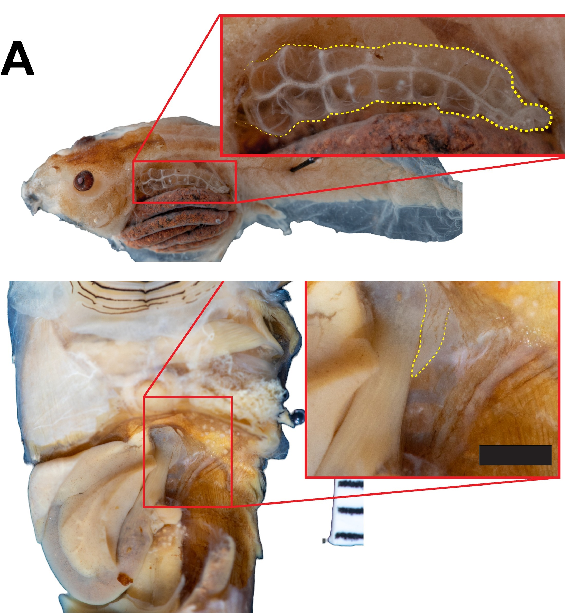
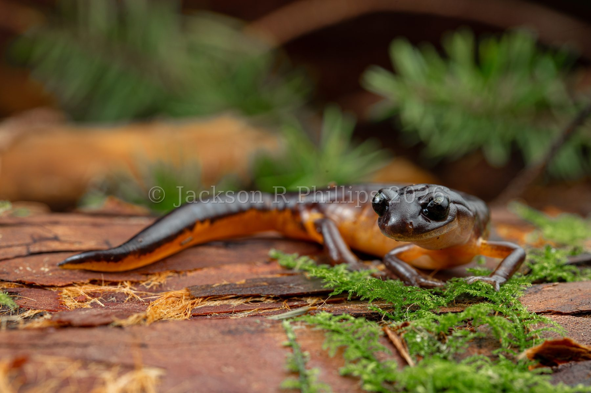
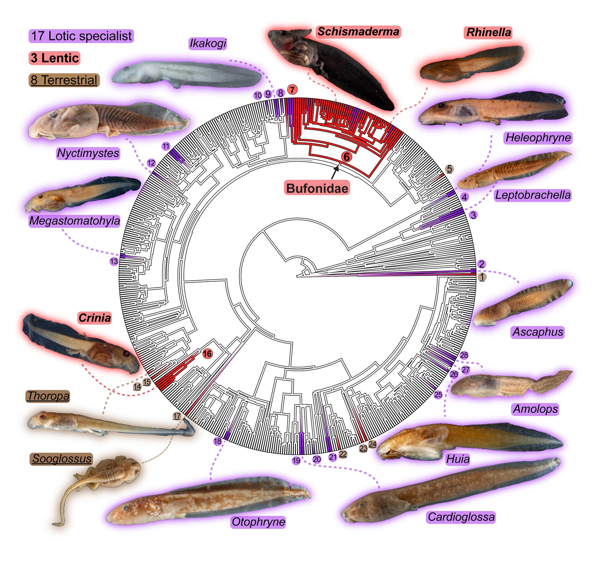
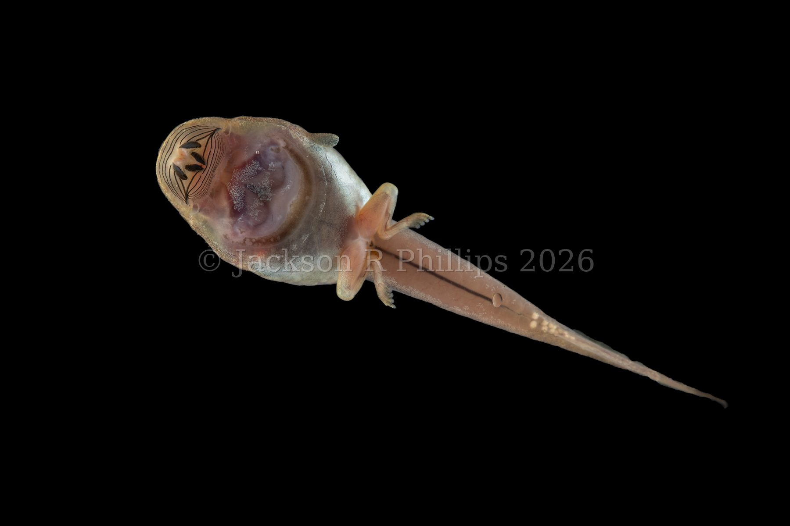
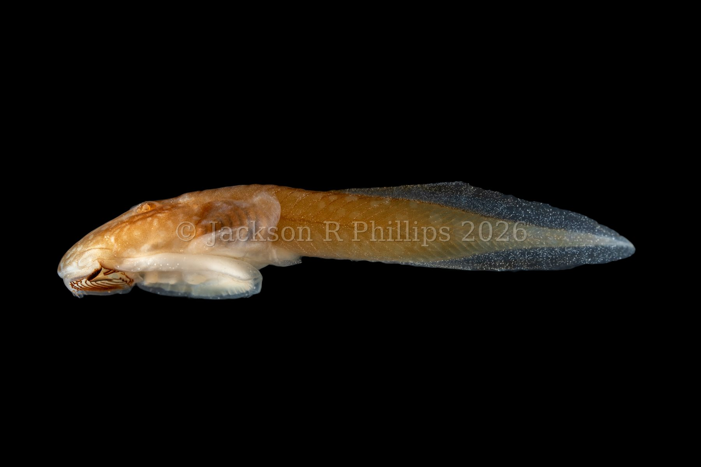
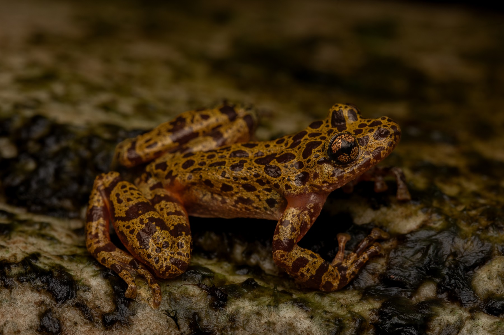

<!-- VIDEO-SCHEMA:START -->
```{=html}
<script type="application/ld+json">
{
 "@context": "https://schema.org",
 "@type": "VideoObject",
 "name": "An ordinary air breath, from a tadpole with ordinary lungs",
 "description": "Spea intermontana, filmed for comparison against the lungless breathing in Bubble guts and Why lose a lung?. Mouth open, straight up through the surface, gulp, done.",
 "contentUrl": "https://tadpology.com/assets/video/spea-intermontana-breath-comparison.mp4",
 "thumbnailUrl": "https://tadpology.com/assets/video/thumbs/spea-intermontana-breath-comparison.jpg",
 "creator": {
  "@type": "Person",
  "name": "Jackson Phillips"
 },
 "copyrightNotice": "\u00a9 Jackson Phillips",
 "creditText": "Jackson Phillips",
 "license": "https://tadpology.com/license.html",
 "acquireLicensePage": "https://tadpology.com/license.html"
}
</script>
```
<!-- VIDEO-SCHEMA:END -->
Read [here](do-tadpoles-have-lungs.qmd) to learn about tadpole air breathing, where I talk about the fact that, contrary to public opinion, tadpoles do have lungs. 

::: {.video-figure}


***Spea intermontana* tadpole breathing air in slow motion.**
:::

It's true that most tadpoles breathe air, but like most things in biology, there are always exceptions.

Indeed, some tadpoles never make working lungs. They often develop tiny, non-vascular and uninflated lung "buds", and rely on their gills and skin to get the oxygen they need. But now I'm getting ahead of myself.

::: {.video-figure}
{fig-alt="Two dissection photos with zoomed insets: a large, densely branching, vascular lung outlined in yellow in a lunged tadpole (Notaden nicholsi), and a tiny thread-like lung bud outlined in yellow in a lungless tadpole (Odontobatrachus natator)"}

**Same organ, two very different amounts of it**
Top: *Notaden nicholsi*, with a large, richly vascularized lung, typical of
an ordinary lunged tadpole. Bottom: *Odontobatrachus natator*, a lungless,
suctorial species, whose "lung" is a non-functional thread, outlined in
yellow both times so you know what you're looking at.
:::


## Why should you care about lungless tadpoles?

I study lungless tadpoles for two main reasons. Lungless tadpoles provide evolutionary experiments in the evolution of trait loss, a major evolutionary mystery, and because lungless tadpoles are often, but not always, species of special conservation concern. I want to understand why animals lose things like lungs over evolutionary time and when they do, how do they need to be protected? 


## Crash course in evolutionary trait loss

If you don't know what trait loss is, it is when an animal (or any kind of organism) evolves to lose a structure its ancestor had. Famous examples include eyeless animals in caves, the tail-less great apes, and parasitic plants that no longer have green, photosynthetic leaves. 

Why lose? This is still an open area of research, but it seems like one key ingredient in trait loss is *relaxed selection*. When selection is relaxed, it means that the ancestral function a trait or organ served (eyes: seeing) is not as useful as it used to be (like in dark caves!). In the old habitat, natural selection (differential survival and breeding of animals with trait variation) would have maintained a trait, because organims born without it (or with a reduced version) would be less successful. 
Once selection is relaxed however, that selection is less strong, and more variation can creep into the population and eventually evolve an eyeless fish or tail-less monkey. 

## Back to lungs

If you know much about amphibian biology, what do you think of when I say lungless? Lungs aren't really a thing that most animals are willing to give up, but there is one group that has done so, pretty famously. That is the plethodontid salamanders, a group aptly called the "lungless salamanders".

::: {.video-figure}
{fig-alt="An Ensatina salamander, orange-bodied with a dark head and tail, standing on mossy redwood bark"}

**A lungless salamander: *Ensatina eschscholtzii*, coastal California.**
:::

The origins of this group is an old mystery: why lose your lungs? As you might know, lungs are pretty handy. There are two main hypotheses proposed for where and why lungless salamanders got their start. 

::: {.todo}
PHOTO NEEDED: a small, half-width shot of a clear, cold, fast stream. I
couldn't find one anywhere in the photo library. Drop one in
`assets/images/` and tell me the filename, or add it to
`photos-source/Wildlife/` and I'll wire it up.
:::

The first is that plethodontid ancestors evolved in a region like the modern day Smoky Mountains, a region covered in clear, cold, and well-oxygenated streams. Tadpoles living in those streams probably didn't need lungs for oxygen, so any downsides of lungs could lead to their loss. 

The alternative view was that plethodontid salamanders were actually becoming more terrestrial when they lost their lungs. This might seem counter-intuitive, but lungs can often be more important in water than on land, depending who you are. The atmosphere of Earth has a *ton* of oxygen, produced by all the green things in your yard. Way more oxygen, in fact, than any body of water on the planet, since oxygen is not very soluble in water. Check out [this chapter on vertebrate respiration](https://pressbooks.palni.org/comparativevertebrateandhumananatomy/chapter/respiratory-system/) I co-wrote for more info on concentration gradients and why lungs are really useful in the water. But, long story short, if you are small enough, have a big enough surface area, and your skin can take up oxygen well, then lungs might not be that important out of the water. 

These hypotheses have been really hard to test in salamanders because there aren't very many lungless groups. Plethodontids are big, but they all represent a single loss "event". And even so, plethdontids are split, with many stream lineages and many terrestrial lineages. 

## Lungless tadpoles present another evolutionary system to understand why lungs are lost.

In a study I published in the journal [Evolution](https://drive.google.com/file/d/1PZB4Vz54pCSAdVQSWUlmjAtCG5JA9dvL/view), I found that lungs have been lost nearly 28 times in tadpoles: way more than in salamanders! I found that about 20% of tadpoles are lungless, and these tads be split into three major types: typical tadpoles you'd never suspect were lungless, stream-specialized tadpoles living in fast-flowing torrents, and tadpoles that spend a lot of time on land (terrestrial/semi-terrestrial).

::: {.video-figure}
{fig-alt="Circular phylogenetic tree of frog genera, with 28 branches marked as independent losses of tadpole lungs, color-coded and labeled as 17 lotic specialists, 3 lentic, and 8 terrestrial lineages, with tadpole photos around the outside"}

**All 28 independent losses**
Purple branches are lotic specialists (the sucker-mouthed climbers and
sand-burrowers), red is lentic (still water), and brown, underlined names
are terrestrial. 
:::


## Tadpoles lose lungs in streams

17 of those losses pretty clearly happened in fast-flowing streams, as predicted in plethodontid salamanders! This makes a lot of sense: cold, fast-flowing streams are the best-oxygenated waterbodies in the world. Tadpoles can probably get all the oxygen they need, year-round, so long as the streams keep flowing. 

This should *relax selection* on lungs.

Once selection is relaxed, costs can lead to loss. 

What kinds of costs could this be? Imagine you're in a nice deep pond and want to float at the surface without spending energy: what do you do? You might get a floating device of some kind, which are often just plastic bags full of air. Think about the bright yellow ducks that parents put on little kids at the pool. Lungs do the same thing: air is very light, so a full lung increases *buoyancy*. 

In a pond, that might be great, but being positively buoyant in a fast-flowing stream makes it really hard to hold on, especially under the water. 

And where do all streams lead, eventually? *the ocean* and tadpoles do not do very well in the ocean (or big lakes for that matter).

For suctorial tadpoles, this explanation makes some sense. 

What is a suctorial tadpole? It is a kind of tadpole that has specifically evolved to live in the fastest parts of the fastest streams.

::: {.video-figure}
{fig-alt="Ventral view of a live Meristogenys tadpole against a black background, showing the large oral disc with dark tooth rows and a broad, flattened underside"}

**A suctorial tadpole, *Meristogenys*, seen from below.**
Just about the whole underside is given over to the business of holding on.
:::

These tadpoles have suction cups they use to hold onto rocks in fast flow, where they are protected from predators, can feed on algae other tadpoles can't reach, and get all the oxygen they could want. 

Some use their mouths to hold onto stuff

::: {.todo}
FIGURE PLACEHOLDER: your composite of mouth-holding suctorial tadpoles. Send
it over whenever it's ready and I'll drop it in here.
:::

And others use a suction cup on their belly to hold on, leaving their mouths free to do whatever they'd like. These tadpoles are called "gastromyzophorous": just an excellent word.

::: {.video-figure}
{fig-alt="Lateral view of a Huia cavitympanum tadpole against a black background, showing a large pale oval abdominal sucker on its belly behind the head"}

**A gastromyzophorous tadpole, *Huia cavitympanum*.**
That pale oval tucked under the body, just behind the head, is the belly
sucker seen from the side.
:::

These tadpoles are frequently lungless, perhaps because holding on in the current is difficult enough without an internal air bag that you need to let go our favorite rock to come up and fill with air.


## Tadpoles lose lungs on land

The other type of lungless tadpole with plenty of exampels across the frog tree are terrestrial tadpoles, which live either along streams, where waterfalls mist the rocks, or in nests built by adult frogs. In both cases, the tadpoles' skin can stay moist enough to get oxygen directly from the atmosphere, relaxing selection on lungs.

Unlike the suctorial tadpoles, these terrestrial tadpoles don't have another reason to lose lungs, so why do it? The truth is, we don't really know! Roughly half the terrestrial tadpoles we sampled had and didn't have lungs, with no obvious differences between the two. 


## And then, the others

Now that we've gone from tadpoles have lungs, but some tadpoles don't have lungs, to certain kinds of tadpoles don't have lungs, it is time for the final wrinkle. As I said before, exceptions to rules are where really interesting biology lives. 


There are several lungless lineages with totally normal tadpoles. They are usually pretty non-buoyant and live on the bottom of ponds, but are otherwise usually pretty ordinary. 

The most famous such group are the bufonids, members of the frog family Bufonidae. These are also called the "true toads". Toad tadpoles don't have lungs, and we have no idea why! Just like plethodontid salamanders, this group is full of different kinds of tadpoles, but all of them are lungless and descended from some mysterious ancestor more than 50 million years ago!

::: {.todo}
LINK NEEDED: the education page on frogs vs. toads doesn't exist yet. Once
it does, point "true toads" above at it.
:::

## What do we learn about lung loss?

To our surprise, our research provided support to both hypotheses of lung loss in plethodontids: streams and terrestriality. In tadpoles, both routes were clearly possible. This study increases our confidence in both mechanisms, but the answer in plethodontids may always be a mystery, lost to time.


## What about the conservation of lungless tadpoles?

Check out [this study](https://www.researchgate.net/publication/379862165_Habitat_and_respiratory_strategy_effects_on_hypoxia_performance_in_anuran_tadpoles) I performed looking at how lungless, lunged, stream, and pond tadpoles tolerate low oxygen.

We found that lungless, stream tadpoles were by far the most vulnerable to hypoxia. Stream tadpoles with lungs tolerated hypoxia much better than their lungless counterparts, and lungless pond tadpoles also did much better, implying they have evolved other ways of getting oxygen besids the lungs. 

That study calls for stronger protections of stream flows for endangered species like the Hewitt's Ghost Frog, as lungless tadpoles cannot tolerate even temporary periods of no flow.

::: {.video-figure}
{fig-alt="A Heleophryne hewitti ghost frog, mottled gold and dark brown with a vertical pupil and broad finger discs, sitting on wet algae-covered rock in a stream"}

**Hewitt's ghost frog, *Heleophryne hewitti*, Eastern Cape, 2022.**
:::

## Once they're gone, are lungs gone forever?

After losing them, lungs have never come back. Check out [this post](once-lost-gone-forever.qmd) for a discussion of irreversibility in evolution, and [this post](bubble-guts.qmd) for a discussion of the only bufonid tadpole that has come close. 


---

*Phillips, JR, PH Dias, and MC Womack (2025). Lungless tadpoles breathe fresh
air into hypotheses for tetrapod lung loss and trait regains.* Evolution
*79(12), 2776-2790.*

*Phillips, JR, GK Nicolau, SS Ngwenya, EA Jackson, and MC Womack (2024).
Habitat and respiratory strategy effects on hypoxia performance in anuran
tadpoles.* Integrative and Comparative Biology *64(2), 336-353.*

*Phillips, JR, J Reissig, and GK Nicolau (2023). Notes on lung development in
South African ghost frogs (Anura: Heleophrynidae).* African Journal of
Herpetology *72(1), 81-90.*
