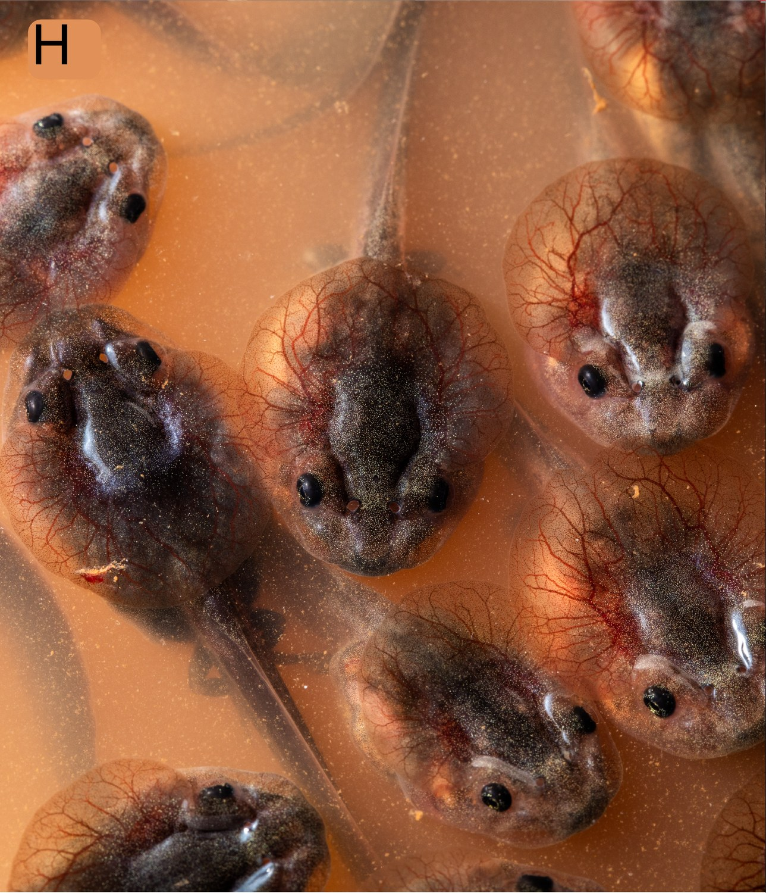

In the last post I told you that most tadpoles breathe air with lungs, starting
almost as soon as they hatch. That's true, and it's the rule. But like most
rules in biology, it has exceptions, and the exceptions are the interesting
part.

Some tadpoles never develop working lungs at all. Not "not yet," not "small
and forming," but functionally absent: tiny, non-vascularized nubs that never
inflate, sitting where a real lung would be. And here's the part that makes it
strange rather than just a fun fact: those same tadpoles grow up into
completely normal, fully lunged, air-breathing adult frogs. The loss is
specific to the tadpole stage. Whatever machinery it takes to build a lung is
still in there. It just doesn't get switched on until later.

::: {.todo}
FIGURE PLACEHOLDER: side-by-side dissection photos, a typical lunged tadpole
with large, vascular lungs next to a lungless tadpole with a tiny, smooth lung
bud (your Figure 1 material from the Evolution paper works well here).
:::

## A lung is a balloon, and balloons are bad news in a current

So who are these tadpoles, and why would they do this?

Almost all of them live in fast water: mountain streams, rapids, torrents,
the kind of current that will sweep away anything that lets go for a moment.
And a lung, mechanically speaking, is a bag of air. Bags of air float. An
animal trying to stay pinned to a rock in a torrent does not want to be
buoyant, and it definitely does not want to leave that rock every few minutes
to go refill the bag at the surface.

Tadpoles that live this way tend to look the part. Most have flattened
bodies, and many have evolved a sucker-like mouth, essentially a suction cup
where a normal tadpole would have a soft, fleshy disc, that lets them cling to
rock faces in current strong enough to knock a person over. There's a
wonderful word for this: gastromyzophorous, from Greek roots meaning
belly-sucker-bearing. Some gastromyzophorous tadpoles can hold on to, and even
climb, wet vertical rock in the spray zone next to a waterfall.

::: {.todo}
FIGURE PLACEHOLDER: ventral close-up of a sucker-mouthed (gastromyzophorous)
tadpole, ideally one of yours, showing the oral disc modified into a suction
cup.
:::

Other lungless tadpoles solve the current a different way, by not being out
in it at all: they wedge themselves into sand, gravel, or leaf litter at the
stream bottom instead of clinging to the surface of a rock. Either way, the
habitat is the same, and a lung is the same kind of liability.

## So how often does this actually happen?

To find out whether that story actually holds up, my coauthors and I put
together the largest dataset of its kind: larval lung presence or absence
across 529 frog species in 44 families, mapped onto a modern, time-calibrated
family tree of frogs.

We found at least 28 independent origins of tadpole lunglessness scattered
across the anuran tree. That's not one weird lineage doing something strange.
That's dozens of unrelated groups arriving at the same solution on their own.
And the pattern was exactly what the mechanical story predicts: lung loss is
overwhelmingly concentrated in stream specialists, both the sucker-mouthed
climbers and the sand-and-gravel dwellers, plus a handful of fully
terrestrial tadpoles that never experience standing water long enough to need
buoyancy control at all.

::: {.todo}
FIGURE PLACEHOLDER: the phylogeny figure showing the 28 independent losses of
larval lungs mapped across the frog tree, color-coded by lotic specialist,
lentic, and terrestrial (your Figure 2/4 material from the Evolution paper).
:::

The exceptions are almost more interesting than the rule. A few lungless
lineages live in still water, where none of the current-and-buoyancy logic
applies, and those species have each independently evolved their own strange
workaround for getting oxygen without lungs. The African forest toad
*Mertensophryne* has a bizarre, doughnut-shaped crest on its head. The red toad
*Schismaderma* has evolved a fold of skin across the top of its head, dense
with blood vessels, that appears to work like an external gill for pulling
oxygen straight from the air. Neither one needed to reinvent the lung. They
just needed a patch of well-vascularized skin in the right place.

::: {.video-figure}
{fig-alt="Close-up of several Schismaderma tadpole heads at the water's surface, each showing a dense network of red blood vessels across a fold of skin on top of the head"}

**_Schismaderma carens_, crest pressed against the air**
That red, branching pattern is a dense network of blood vessels, sitting
right against the underside of the surface film. More on exactly what this
tadpole is up to in a later post.
:::

## Two ghost frogs, same river, very different lungs

Here's a case that makes the whole picture messier, in the best way.

South Africa's ghost frogs (family Heleophrynidae) are about as
torrent-adapted as tadpoles get: flattened bodies, big sucker mouths, life
spent gripping rock in cold, fast mountain streams. The family has two
genera, *Heleophryne* and *Hadromophryne*, and they diverged from each other
around 64 million years ago. By the logic above, you'd expect both to have
ditched their lungs long ago.

Only one of them did. When we dissected tadpoles of both genera, *Heleophryne*
turned out to be essentially lungless, just like the pattern predicts. But
*Hadromophryne natalensis*, living in the same kind of stream, doing the same
sucker-mouthed rock-clinging, has small, thin-walled lungs that are clearly
inflated and functional.

::: {.todo}
FIGURE PLACEHOLDER: side-by-side dissection comparison of a lungless
*Heleophryne* tadpole and a lunged *Hadromophryne* tadpole (your Figure 2/3
material from the ghost frog note).
:::

Why would one torrent specialist keep its lungs while its closest relative
lost them entirely? We don't know for certain, but there's a suggestive clue:
*Hadromophryne* tadpoles are known to climb right out of the water onto wet,
vertical rock faces, something *Heleophryne* tadpoles have never been observed
doing. Out of the water, gills stop working, but a lung would still function
just fine. It's possible that willingness to leave the stream, even briefly,
is exactly what has kept the lungs of *Hadromophryne* in business.

## Maybe it's not really about the air

The standard explanation for lung loss has always been about gas exchange:
streams are cold and full of dissolved oxygen, so a tadpole living there
doesn't need lungs to survive, and eventually stops making them. That's a
perfectly reasonable story, but it doesn't quite explain why lung loss is so
narrowly concentrated in the suckered and burrowing specialists, rather than
showing up broadly across every tadpole that lives in a well-oxygenated
stream. Plenty of ordinary, lunged tadpoles share those same streams without
any apparent problem.

We think there's a piece missing, and it isn't about oxygen levels at all.
It's about how dangerous or costly it is to actually go breathe.

For a sucker-mouthed tadpole gripping a rock in strong current, letting go to
swim up for a breath means risking getting swept downstream, and the return
trip against the current is not guaranteed. For a tadpole buried in sand or
gravel, coming up to the surface means becoming visible to everything that
would like to eat it. In both cases, the behavior of air-breathing itself,
not the need for oxygen, is what got expensive.

That distinction matters because a lung isn't a passive structure that just
sits there ready to go. It needs to actually be used, inflated with real
breaths, to develop properly. Experiments have shown that if you prevent a
tadpole from air-breathing, even one that would normally be a strong,
frequent breather, its lungs fail to develop normally. So if a lineage stops
finding it worthwhile to come up for air, whether because it's dangerous,
exhausting, or simply unnecessary, the lungs don't need to be actively
selected against to disappear. They just stop being built.

## Does losing a lung ever cost you anything?

All of this raises an obvious question: if lungless tadpoles are doing fine
without lungs, does it ever come back to bite them?

To test this, we caught wild tadpoles representing 15 genera and 10 families,
some lunged and some naturally lungless, some from ponds and some from
streams, and dropped them into a low-oxygen environment to see how well they
coped.

Pond-living lungless tadpoles, like the toads with their weird head
ornaments, handled low oxygen just fine. That tracks: they evolved their
lunglessness alongside a backup plan for exactly this scenario. Stream-living
tadpoles were a different story entirely. Both lunged and lungless
stream-dwellers were more strongly affected by low oxygen than their pond
relatives, and the lungless stream tadpoles fared the worst of every group we
tested.

::: {.todo}
FIGURE PLACEHOLDER: simplified version of the responsiveness-under-hypoxia
comparison across lunged/lungless and pond/stream tadpoles (your Figure 1
material from the hypoxia paper).
:::

That makes sense once you think about it from the tadpole's perspective.
Streams and torrents are almost never low in oxygen, so a stream-living
species has never needed to evolve a way to cope when oxygen drops, lungs or
no lungs. That's a fine bet to make, right up until something changes the
water itself. Dam construction, groundwater pumping, and drought can all
reduce or interrupt streamflow, and stagnant water gets hypoxic fast. The
critically endangered Table Mountain ghost frog, *Heleophryne rosei*, has
declined sharply alongside reservoir construction that reduced flow in the
streams it depends on. A tadpole that lost its lungs because breathing air
was once dangerous may now be stuck without one, in a stream that no longer
behaves the way it did when that trade was made.

Which leaves an obvious follow-up question: once a tadpole's lineage has gone
this route, is there any way back? That turns out to be a much bigger
question than it sounds, and it's worth a post of its own.

---

*Phillips, JR, PH Dias, and MC Womack (2025). Lungless tadpoles breathe fresh
air into hypotheses for tetrapod lung loss and trait regains.* Evolution
*79(12), 2776-2790.*

*Phillips, JR, GK Nicolau, SS Ngwenya, EA Jackson, and MC Womack (2024).
Habitat and respiratory strategy effects on hypoxia performance in anuran
tadpoles.* Integrative and Comparative Biology *64(2), 336-353.*

*Phillips, JR, J Reissig, and GK Nicolau (2023). Notes on lung development in
South African ghost frogs (Anura: Heleophrynidae).* African Journal of
Herpetology *72(1), 81-90.*
